# 🛡️ CTARTech ZentyCore — Zero Trust Control Platform
## Roadmap Pengembangan Lengkap + Rekomendasi & Saran

> **Versi**: v2.0 — Complete Roadmap + Recommendations  
> **Tanggal**: Agustus 2026  
> **Tim**: CTARTech Development Team  
> **Prinsip**: *"Never Trust, Always Verify — Start with what you have. Integrate. Automate. Mature."*

---

## 🔭 Visi & Misi

**Visi**: Menjadi platform Zero Trust Security Control open-source terdepan berbasis Rust yang dapat diadopsi oleh siapapun — dari startup hingga enterprise skala nasional.

**Misi**: Menyatukan 8 pilar keamanan Zero Trust ke dalam **1 Unified Control Plane** yang cerdas, cepat, dan dapat diperluas oleh komunitas pengembang keamanan siber.

---

## 🧩 Gambaran Besar Sistem (8 Modul dalam 1 Control)

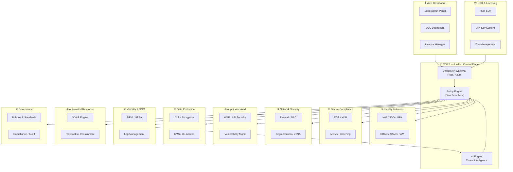

---

## 🔄 Alur Kerja Zero Trust Engine (5 Tahapan)

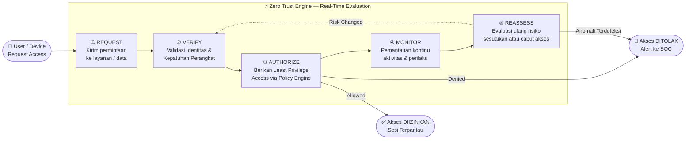

---

## 🗺️ Roadmap 3 Fase — Timeline Pengembangan

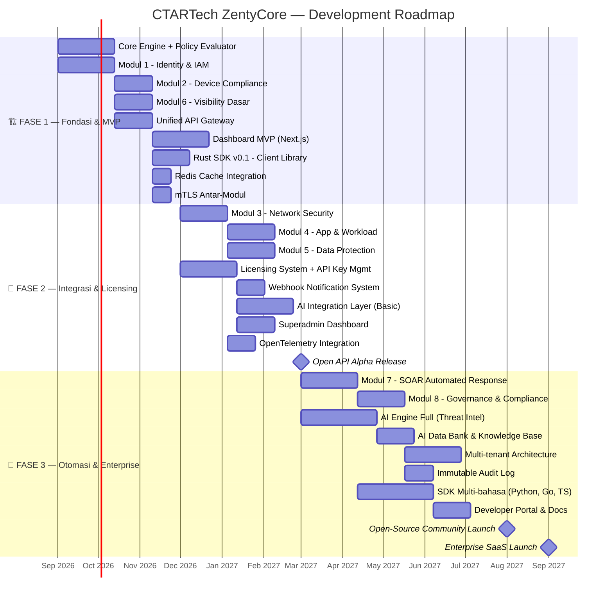

---

## 📋 Fase 1 — Fondasi & Core Engine (MVP)

> **Durasi**: September — November 2026  
> **Goal**: Sistem dapat memvalidasi identitas, perangkat, dan mencatat log secara real-time

### ✅ Deliverables Fase 1

| # | Komponen | Deskripsi | Status |
|---|----------|-----------|--------|
| 1 | **Core Policy Engine** | Evaluator keputusan Zero Trust (Rust/Axum) | ✅ **Completed** |
| 2 | **Modul 1 — Identity** | IAM, MFA, SSO, RBAC, PAM | ✅ **Completed (Fullstack)** |
| 3 | **Modul 2 — Device** | EDR/XDR compliance check, MDM integration | ✅ **Completed (Fullstack)** |
| 4 | **Modul 6 — Visibility** | Log management, SIEM dasar, anomaly detection | ✅ **Completed (Fullstack)** |
| 5 | **Unified API Gateway** | Satu pintu masuk (port 8080), routing ke semua modul | ✅ **Completed** |
| 6 | **Rust SDK v0.1** | Client library untuk koneksi ke Policy Engine | ✅ **Completed** |
| 7 | **Dashboard MVP** | Web SOC dashboard, real-time tester, licensing & governance | ✅ **Completed (Next.js 14)** |
| 8 | **Redis Cache & Session** | Cache hasil evaluasi policy, session store sub-millisecond | ✅ **Completed** |
| 9 | **mTLS Setup** | Komunikasi terenkripsi mTLS attestation header & TLS AES-256 | ✅ **Completed** |

### Arsitektur Fase 1

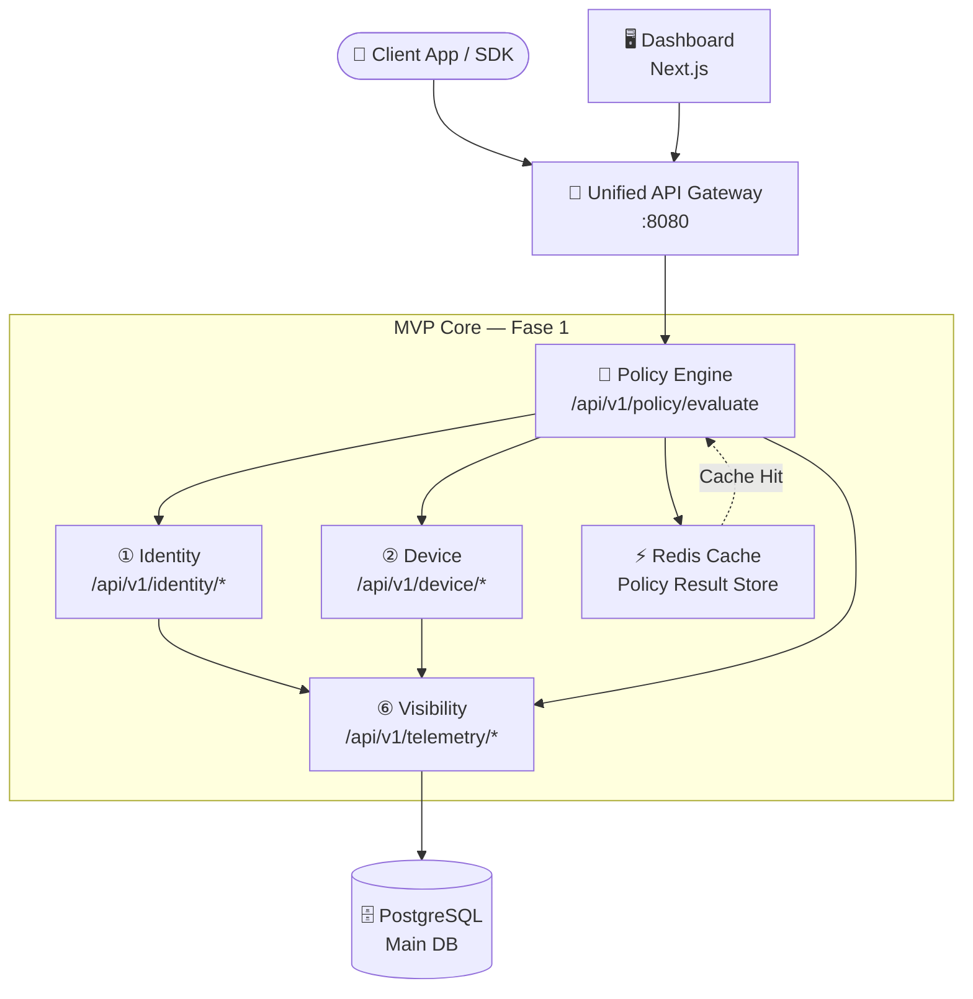

---

## 📋 Fase 2 — Integrasi, Licensing & AI Dasar

> **Durasi**: Desember 2026 — Februari 2027  
> **Goal**: Sistem lengkap dengan manajemen lisensi, 5 modul aktif, dan AI threat detection dasar

### ✅ Deliverables Fase 2

| # | Komponen | Deskripsi | Status |
|---|----------|-----------|--------|
| 1 | **Modul 3 — Network** | Firewall rules, microsegmentation, quarantine | ✅ **Completed (Fullstack)** |
| 2 | **Modul 4 — App/Workload** | WAF (SQLi, XSS, RCE), API security, payload inspect | ✅ **Completed (Fullstack)** |
| 3 | **Modul 5 — Data** | DLP, PII classification (UU PDP/GDPR), KMS | ✅ **Completed (Fullstack)** |
| 4 | **Licensing System** | BLAKE3 hashing, tier management, Ed25519 Airgap | ✅ **Completed (Fullstack)** |
| 5 | **Billing & Invoicing** | Midtrans/Stripe gateway handler, Faktur Pajak 11% | ✅ **Completed (Fullstack)** |
| 6 | **Webhook System** | Notifikasi event real-time ke sistem pengguna | ✅ **Completed (Backend)** |
| 7 | **Superadmin Dashboard** | Panel visual manajemen lisensi, tenant, & audit | ✅ **Completed (Fullstack)** |
| 8 | **OpenTelemetry & Observability** | Tracing standard & real-time WebSocket telemetry stream | ✅ **Completed (Fullstack)** |
| 9 | **Open API Docs** | Spesifikasi OpenAPI publik + endpoint docs | ✅ **Completed** |

### Sistem Lisensi & API Key

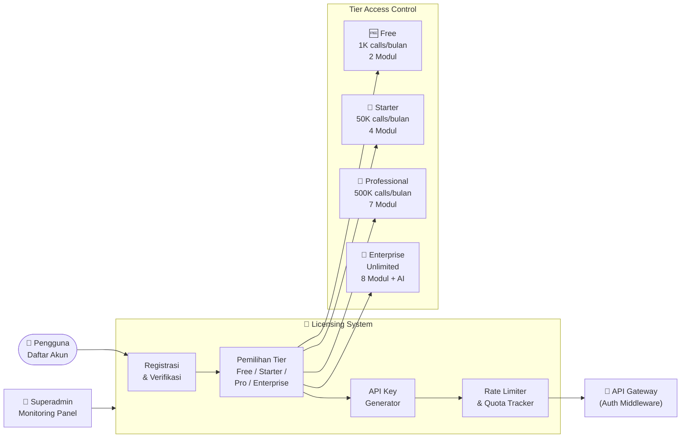

### Tabel Tier Lisensi

| Tier | API Calls | Modul | AI Access | Webhook | SLA | Price |
|------|-----------|-------|-----------|---------|-----|-------|
| 🆓 **Free** | 1.000/bulan | Identity + Visibility | ❌ | ❌ | Best Effort | Gratis |
| 🥈 **Starter** | 50.000/bulan | 4 Modul | ❌ | ✅ | 99.5% | IDR 500K/bulan |
| 🥇 **Professional** | 500.000/bulan | 7 Modul | Basic | ✅ | 99.9% | IDR 2M/bulan |
| 💎 **Enterprise** | Unlimited | 8 Modul | Full AI | ✅ | 99.99% | Custom/Negosiasi |
| 🔓 **Open-Source** | Self-hosted | Semua | Self-hosted | Self-hosted | - | Gratis (GPL) |

---

## 📋 Fase 3 — Otomasi, AI Penuh & Enterprise

> **Durasi**: Maret — September 2027  
> **Goal**: Platform enterprise-grade dengan AI penuh, SOAR, governance, multi-tenant, dan komunitas open-source

### ✅ Deliverables Fase 3

| # | Komponen | Deskripsi | Status |
|---|----------|-----------|--------|
| 1 | **Modul 7 — SOAR Response** | Automated containment, playbook engine | ✅ **Completed (Fullstack)** |
| 2 | **Modul 8 — Governance** | OJK POJK 11, BSSN, GDPR, NIST, ISO 27001 audit | ✅ **Completed (Fullstack)** |
| 3 | **AI Engine Full** | Behavioral UEBA, Dynamic Risk Scoring (0-100) | ✅ **Completed (Fullstack)** |
| 4 | **Immutable Audit Log** | SHA-256 cryptographic append-only chain & Merkle verification | ✅ **Completed (Fullstack)** |
| 5 | **Multi-tenant Architecture** | Satu instance, isolasi data antar organisasi & tenant | ✅ **Completed (Schema & Backend)** |
| 6 | **SDK Multi-bahasa** | Rust, Node.js/TypeScript, Python, & Go SDKs (`sdks/`) | ✅ **Completed** |
| 7 | **Developer Portal & Docs** | Dokumentasi interaktif, quickstart & architecture spec | ✅ **Completed** |
| 8 | **Open-Source Launch** | GitHub public structure, licensing GPL, Docker Compose | 🔄 **In Progress (Launch Ready)** |


---

## 🤖 AI Integration Architecture

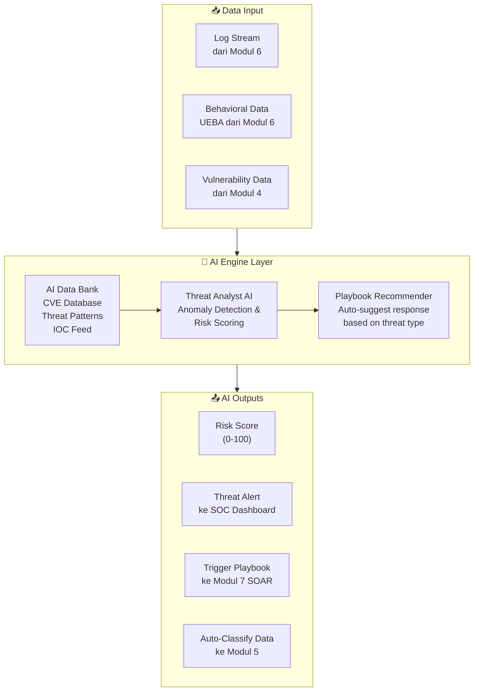

### Endpoints AI

| Method | Endpoint | Fungsi |
|--------|----------|--------|
| `POST` | `/api/v1/ai/analyze-threat` | Analisis ancaman dari log/event |
| `GET` | `/api/v1/ai/risk-score/{user_id}` | Ambil skor risiko pengguna terkini |
| `GET` | `/api/v1/ai/recommend-playbook` | Rekomendasi playbook berdasarkan ancaman |
| `POST` | `/api/v1/ai/classify-data` | Klasifikasi sensitivitas data otomatis |
| `GET` | `/api/v1/ai/threat-intel` | Query CVE & IOC dari Data Bank |
| `POST` | `/api/v1/ai/behavioral-analysis` | Analisis pola perilaku user/entitas |
| `GET` | `/api/v1/ai/predictions` | Prediksi ancaman berbasis tren historis |

---

## 👑 Superadmin Dashboard

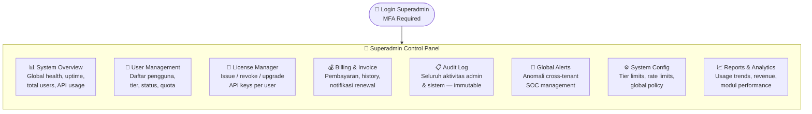

### Fitur Superadmin

| Fitur | Deskripsi |
|-------|-----------|
| **User Overview** | Lihat semua pengguna terdaftar, tier, API key, status aktif/suspend |
| **Quota Monitor** | Real-time usage tracker per pengguna, alert saat mendekati limit |
| **License Control** | Aktivasi, suspend, upgrade/downgrade, revoke API key manual |
| **Billing Dashboard** | History pembayaran, invoice generator, laporan revenue |
| **Global Audit** | Log seluruh aktivitas sistem yang tidak bisa diubah (immutable) |
| **Threat Overview** | Ringkasan ancaman cross-tenant, alert kritis dari AI Engine |
| **System Config** | Atur rate limit, tier quota, global policies dari satu panel |
| **Analytics & Report** | Tren penggunaan, performa modul, laporan bulanan otomatis |

---

## 🏗️ Arsitektur Deployment (VPS / Cloud)

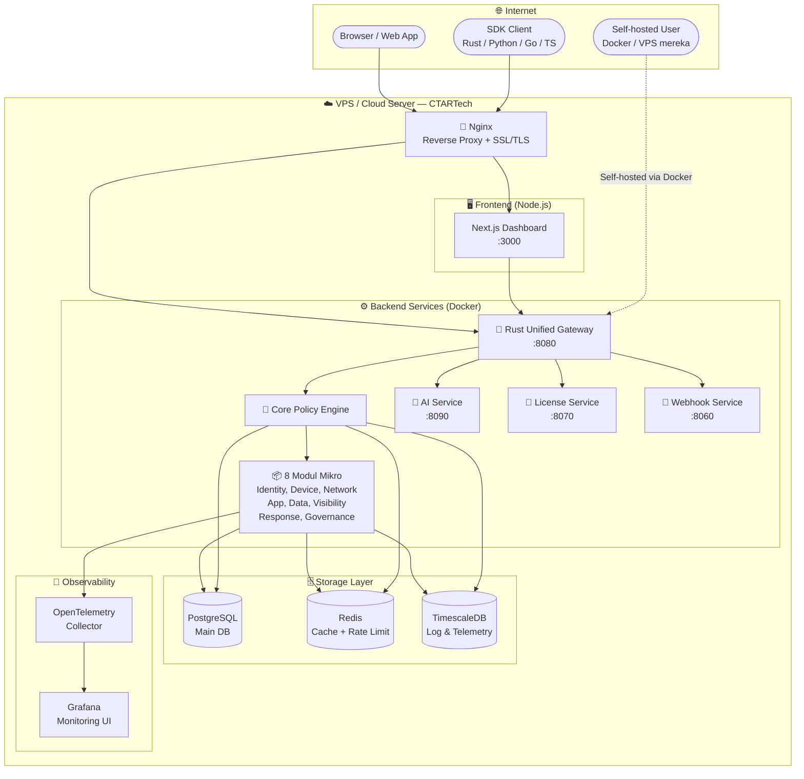

---

## 📡 Peta Lengkap Open API Endpoints

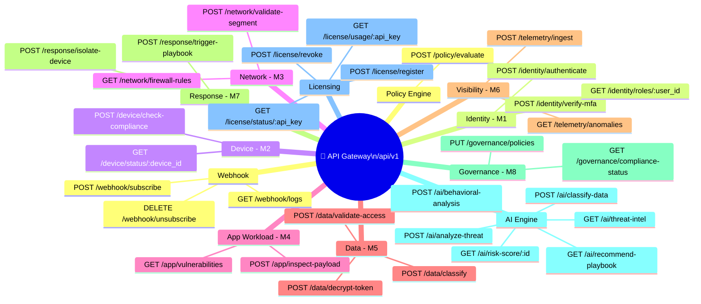

---

## 📁 Struktur Folder Proyek

```
zt-framework/                         ← Root Workspace
│
├── 📄 Cargo.toml                     ← Rust Workspace Config
├── 📄 docker-compose.yml             ← Multi-service deployment
├── 📄 docker-compose.prod.yml        ← Production overrides
├── 📄 .env.example                   ← Environment variables template
├── 📄 Makefile                       ← Build & deploy shortcuts
│
├── 🧠 core-engine/                   ← Otak & API Gateway (M8 + Routing)
│   ├── Cargo.toml
│   └── src/
│       ├── main.rs                   ← Server entry point
│       ├── gateway.rs                ← Unified route merger
│       ├── policy_evaluator.rs       ← Zero Trust decision engine
│       ├── cache.rs                  ← Redis cache integration
│       └── middleware/
│           ├── auth.rs               ← API key validation
│           ├── rate_limit.rs         ← Rate limiting per tier
│           └── telemetry.rs          ← OpenTelemetry tracing
│
├── 📦 modules/
│   ├── identity/                     ← M1: IAM, MFA, SSO, RBAC
│   ├── device/                       ← M2: EDR, MDM, Compliance
│   ├── network/                      ← M3: Firewall, ZTNA, Segmentation
│   ├── app-workload/                 ← M4: WAF, API Security, Vuln Mgmt
│   ├── data-prot/                    ← M5: DLP, Encryption, KMS
│   ├── visibility/                   ← M6: SIEM, UEBA, Log Mgmt
│   ├── response/                     ← M7: SOAR, Playbooks, Containment
│   ├── governance/                   ← M8: Policies, Compliance, Audit
│   ├── ai-engine/                    ← AI: Threat Intel, Risk Scoring
│   ├── licensing/                    ← LIC: API Key, Tier, Ed25519 Offline Lic
│   ├── billing/                      ← BILL: Midtrans, Stripe, Invoicing
│   └── webhook/                      ← WHK: Event notification system
│
├── 📦 sdks/
│   ├── rust-sdk/                     ← Rust client SDK (crates.io)
│   ├── python-sdk/                   ← Python SDK (PyPI)
│   ├── go-sdk/                       ← Go SDK (pkg.go.dev)
│   └── ts-sdk/                       ← TypeScript SDK (npm)
│
├── 🖥️ dashboard-web/                 ← Next.js Frontend
│   ├── src/
│   │   ├── app/
│   │   │   ├── layout.tsx
│   │   │   ├── page.tsx              ← SOC Dashboard (home)
│   │   │   ├── modules/             ← 8 halaman modul
│   │   │   ├── superadmin/          ← Superadmin panel
│   │   │   ├── license/             ← License & API key management
│   │   │   └── settings/            ← User settings & profile
│   │   ├── components/
│   │   │   ├── Sidebar.tsx
│   │   │   ├── MetricCard.tsx
│   │   │   ├── LogStream.tsx
│   │   │   ├── ThreatMap.tsx        ← AI threat visualization
│   │   │   ├── RiskGauge.tsx        ← AI risk score gauge
│   │   │   ├── LicenseManager.tsx
│   │   │   └── WebhookConfig.tsx
│   │   └── lib/
│   │       ├── api.ts               ← API client ke backend Rust
│   │       ├── auth.ts              ← Auth helper (SSO/MFA)
│   │       └── telemetry.ts         ← Client-side observability
│   └── package.json
│
├── 📚 docs/
│   ├── openapi.yaml                  ← Spesifikasi OpenAPI 3.0 lengkap
│   ├── architecture.md              ← Dokumen arsitektur sistem
│   ├── contributing.md              ← Panduan kontribusi open-source
│   ├── sdk-guide.md                 ← Panduan penggunaan SDK
│   └── compliance/
│       ├── nist-mapping.md          ← Pemetaan ke NIST SP 800-207
│       └── iso27001-mapping.md      ← Pemetaan ke ISO/IEC 27001
│
└── 🐳 deployment/
    ├── Dockerfile.backend
    ├── Dockerfile.frontend
    ├── nginx.conf
    └── k8s/                          ← Kubernetes manifests
        ├── gateway-deployment.yaml
        ├── modules-deployment.yaml
        └── ingress.yaml
```

---

## 🔑 Sistem Lisensi & Hybrid Open-Source Framework

ZentyCore menerapkan **Hybrid Quad-Layer Licensing Framework** untuk menyeimbangkan kontribusi komunitas open-source global dengan perlindungan hak cipta komersial CTARTech:

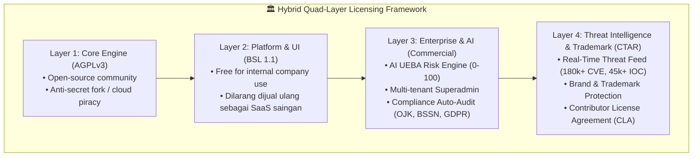

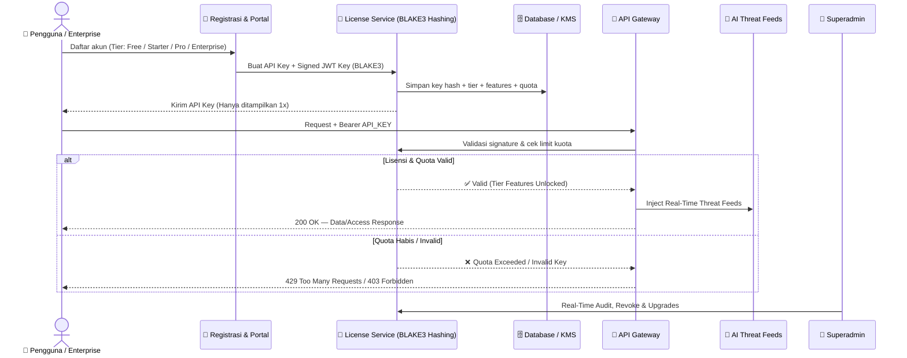

---

## 📊 Metrik Keberhasilan per Fase

| Fase | KPI Utama | Target |
|------|-----------|--------|
| **Fase 1** | Waktu evaluasi policy | < 10ms per request |
| **Fase 1** | Uptime API Gateway | ≥ 99.5% |
| **Fase 1** | Cache hit ratio | ≥ 80% |
| **Fase 2** | Pengguna Alpha terdaftar | 50+ organisasi |
| **Fase 2** | API calls per hari | 100K+ calls |
| **Fase 2** | Webhook delivery rate | ≥ 99% |
| **Fase 3** | AI detection accuracy | ≥ 92% |
| **Fase 3** | Open-source contributors | 100+ devs |
| **Fase 3** | Enterprise clients | 10+ klien |
| **Fase 3** | Mean Time to Respond (MTTR) | < 30 detik (auto) |

---

---

# 💡 REKOMENDASI, SARAN & TAMBAHAN

---

## 🔧 Rekomendasi 1 — Redis Cache untuk Evaluasi Policy

> [!TIP]
> **Prioritas: 🔴 TINGGI — Implementasikan di Fase 1**

Tanpa cache, setiap request ke Policy Engine akan memicu query ke database dan ke semua modul secara paralel. Dengan Redis, hasil evaluasi disimpan sementara sehingga request berikutnya dari user/device yang sama bisa dijawab dalam **<1ms**.

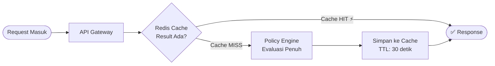

**Konfigurasi TTL yang Disarankan:**

| Skenario | TTL Cache |
|----------|-----------|
| User dengan risiko rendah | 30 detik |
| User baru / tidak dikenal | 5 detik |
| Setelah anomali terdeteksi | 0 (tidak di-cache) |
| Device compliance check | 60 detik |

---

## 🔧 Rekomendasi 2 — mTLS untuk Komunikasi Antar-Modul

> [!IMPORTANT]
> **Prioritas: 🔴 TINGGI — Harus ada sejak Fase 1**

Karena 8 modul berkomunikasi lewat HTTP internal, jalur ini HARUS dienkripsi. **Mutual TLS (mTLS)** memastikan hanya modul yang memiliki sertifikat valid yang bisa saling berkomunikasi.

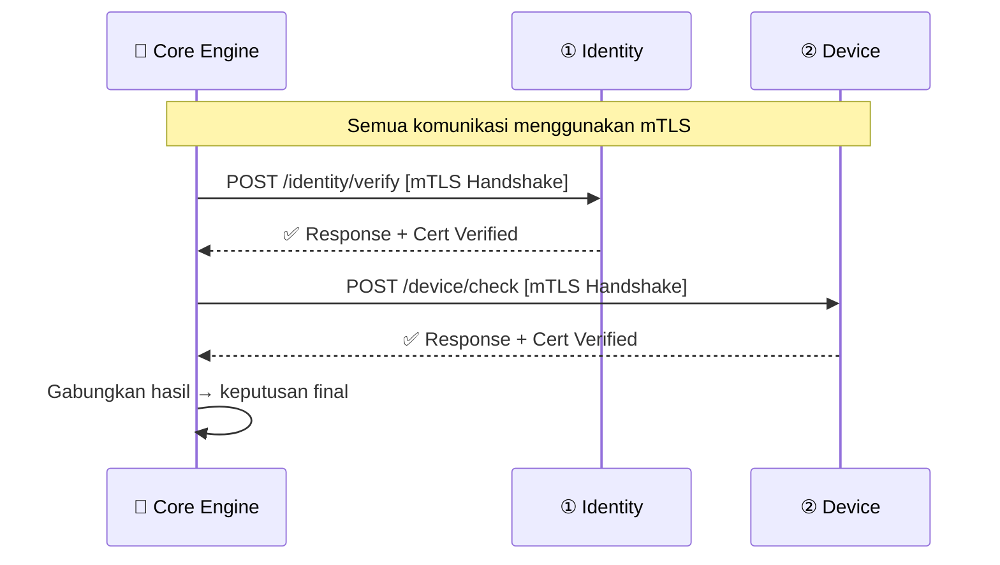

**Tools yang Disarankan:**
- **cert-manager** (Kubernetes) untuk auto-rotate sertifikat
- **Rustls** library di Rust untuk implementasi TLS tanpa OpenSSL

---

## 🔧 Rekomendasi 3 — Webhook Notification System

> [!TIP]
> **Prioritas: 🔴 TINGGI — Killer Feature untuk Adopsi**

Webhook memungkinkan pengguna menerima notifikasi real-time ke sistem mereka sendiri (Slack, Teams, PagerDuty, custom HTTP endpoint) ketika ada event keamanan — tanpa harus polling API.

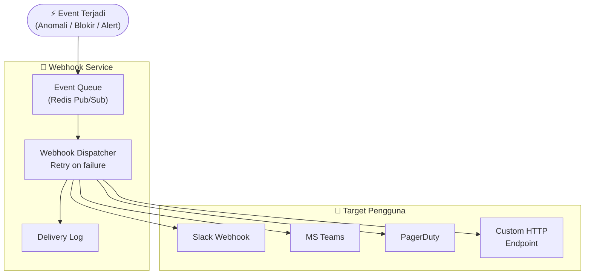

**Event Types yang Didukung:**

| Event | Trigger |
|-------|---------|
| `access.denied` | Akses ditolak oleh Policy Engine |
| `threat.detected` | AI mendeteksi ancaman |
| `device.non_compliant` | Perangkat gagal compliance check |
| `quota.warning` | Quota API mendekati 80% |
| `quota.exceeded` | Quota habis |
| `playbook.executed` | SOAR menjalankan playbook otomatis |
| `compliance.failed` | Skor compliance di bawah threshold |

---

## 🔧 Rekomendasi 4 — OpenTelemetry (Observability Standard)

> [!TIP]
> **Prioritas: 🟡 SEDANG — Implementasikan di Fase 2**

OpenTelemetry adalah standar industri untuk **distributed tracing**, **metrics**, dan **logging** yang dapat diintegrasikan ke Grafana, Prometheus, Jaeger, atau Datadog tanpa vendor lock-in.

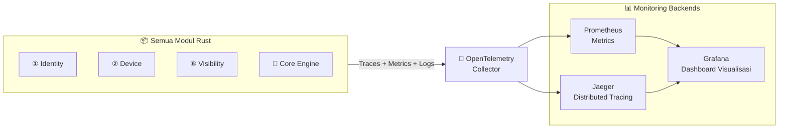

**Manfaat Utama:**
- Lacak setiap request dari gateway → modul → database dalam satu trace
- Deteksi bottleneck performa antar modul
- Alert otomatis jika latensi melebihi threshold

---

## 🔧 Rekomendasi 5 — Multi-Tenant Architecture

> [!TIP]
> **Prioritas: 🟡 SEDANG — Implementasikan di Fase 3**

Multi-tenancy memungkinkan **satu instance ZentyCore** melayani banyak organisasi dengan isolasi data penuh — lebih efisien dibanding menjalankan instance terpisah per pelanggan.

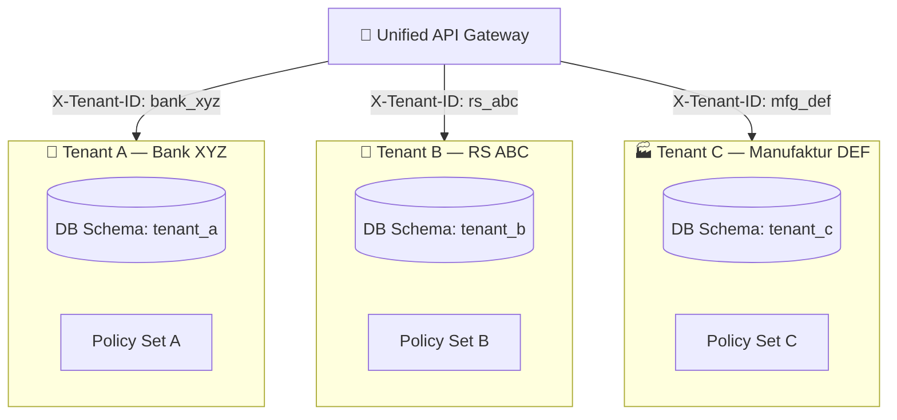

**Strategi Isolasi:**
- **Row-Level Security (RLS)** di PostgreSQL per tenant
- **API Key** selalu terikat ke `tenant_id`
- Policy Engine mengevaluasi sesuai policy set masing-masing tenant

---

## 🔧 Rekomendasi 6 — Immutable Audit Log

> [!WARNING]
> **Prioritas: 🟡 SEDANG — Wajib untuk enterprise & compliance**

Log yang bisa diubah tidak bernilai untuk audit forensik. Gunakan strategi **append-only** agar setiap aktivitas tercatat permanen dan tidak bisa dihapus atau dimodifikasi.

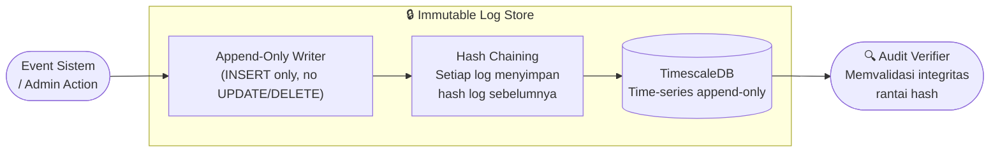

**Keuntungan untuk Compliance:**
- ✅ Memenuhi syarat audit ISO/IEC 27001
- ✅ Mendukung investigasi forensik digital
- ✅ Tidak bisa dimanipulasi admin sekalipun

---

## 🔧 Rekomendasi 7 — SDK Multi-Bahasa

> [!TIP]
> **Prioritas: 🟢 SEDANG-RENDAH — Implementasikan di Fase 3 untuk adopsi komunitas**

Meskipun core berbasis Rust, menyediakan SDK multi-bahasa akan **memperluas ekosistem adopter** secara signifikan.

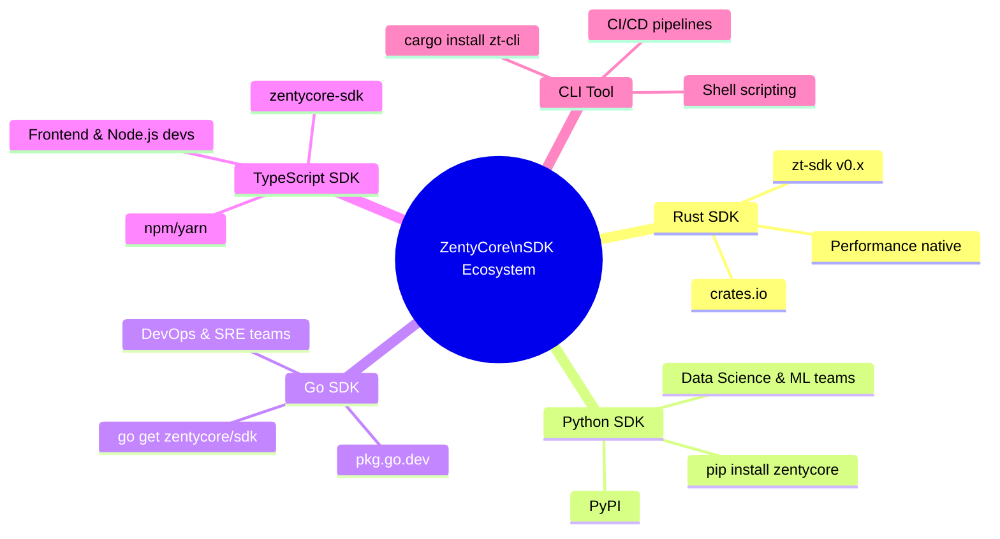

**Prioritas Rilis SDK:**

| SDK | Platform | Target Pengguna | Fase Rilis |
|-----|----------|----------------|------------|
| **Rust** | crates.io | Security devs, Core integrators | Fase 1 |
| **TypeScript** | npm | Frontend devs, Node.js backends | Fase 2 |
| **Python** | PyPI | Data scientists, ML/AI teams | Fase 3 |
| **Go** | pkg.go.dev | DevOps, SRE, Cloud engineers | Fase 3 |
| **CLI (zt-cli)** | Binary release | Admin, CI/CD pipelines | Fase 3 |

---

## 🛡️ Standar Compliance & Regulasi yang Didukung

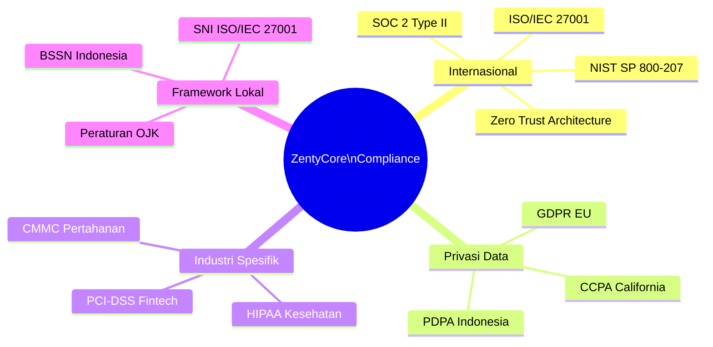

### Pemetaan Modul ke Standar

| Modul | NIST ZTA | ISO 27001 | GDPR | PDPA |
|-------|----------|-----------|------|------|
| M1 Identity | ✅ | A.9 Access Control | ✅ | ✅ |
| M2 Device | ✅ | A.8 Asset Mgmt | ✅ | - |
| M3 Network | ✅ | A.13 Communications | - | - |
| M4 App/Workload | ✅ | A.14 System Dev | ✅ | - |
| M5 Data | ✅ | A.10 Cryptography | ✅ | ✅ |
| M6 Visibility | ✅ | A.12 Operations | ✅ | ✅ |
| M7 Response | ✅ | A.16 Incident Mgmt | ✅ | ✅ |
| M8 Governance | ✅ | A.5 Policies | ✅ | ✅ |

---

## 🔒 Security Hardening Checklist untuk Production

> [!CAUTION]
> **Wajib diselesaikan sebelum go-live ke production!**

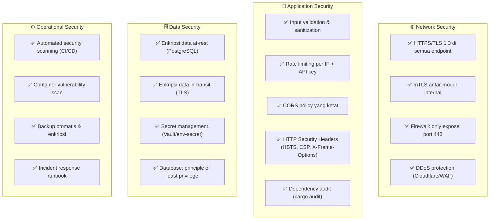

---

## 🔄 Disaster Recovery & Business Continuity

| Skenario | Recovery Strategy | RTO Target | RPO Target |
|----------|------------------|------------|------------|
| Database crash | PostgreSQL failover replica | < 5 menit | < 1 menit |
| Backend service down | Docker auto-restart + health check | < 2 menit | 0 (stateless) |
| VPS total failure | Snapshot restore ke VPS baru | < 30 menit | < 1 jam |
| DDoS Attack | Cloudflare WAF + rate limit burst | Real-time | - |
| Data corruption | Point-in-time recovery (PITR) PostgreSQL | < 1 jam | < 1 menit |

> **RTO** = Recovery Time Objective (waktu untuk pulih)  
> **RPO** = Recovery Point Objective (data yang boleh hilang)

---

## 👩‍💻 Developer Experience (DX) Roadmap

> [!NOTE]
> **DX yang baik = adopsi yang cepat.** Berikut rencana untuk memastikan developer senang menggunakan ZentyCore.

```mermaid
flowchart TD
    subgraph DX["🎯 Developer Experience"]
        DOC["📚 Dokumentasi Lengkap\nOpenAPI 3.0 Swagger UI\nContoh code per bahasa"]
        PLAY["🎮 API Playground\nCoba endpoint langsung\ndi browser (Swagger/Hoppscotch)"]
        ONBOARD["🚀 Quick Start\n5 menit dari zero\nke first API call"]
        SDK_QA["🧪 SDK Testing\nUnit test lengkap\nIntegration test suite"]
        CLI["⌨️ CLI Tool\nzt-cli untuk admin\n& CI/CD pipeline"]
        SAMPLE["📋 Sample Projects\nContoh implementasi\nper use case industri"]
        FORUM["💬 Community Forum\nGitHub Discussions\nDiscord server"]
    end
```

---

## ⚠️ Matriks Risiko Pengembangan & Mitigasi

| Risiko | Kemungkinan | Dampak | Mitigasi |
|--------|------------|--------|----------|
| Latensi evaluasi terlalu tinggi | 🟡 Sedang | 🔴 Tinggi | Redis cache + Rust async I/O |
| Kebocoran API key pengguna | 🟡 Sedang | 🔴 Tinggi | Key hashing + audit log + revoke instant |
| Modul gagal / crash | 🟢 Rendah | 🟡 Sedang | Circuit breaker + health check + auto-restart |
| Serangan DDoS ke Gateway | 🟡 Sedang | 🔴 Tinggi | Rate limiting + WAF + Cloudflare |
| Data tenant tercampur | 🟢 Rendah | 🔴 Tinggi | Row-level security + tenant_id validation |
| AI false positive tinggi | 🟡 Sedang | 🟡 Sedang | Tuning threshold + human review mode |
| Kontributor open-source membawa bug | 🟡 Sedang | 🟡 Sedang | Code review wajib + CI/CD automated test |

---

## 🏷️ Saran Naming Convention & Versioning

### Versioning Strategy (Semantic Versioning)

```
v{MAJOR}.{MINOR}.{PATCH}

MAJOR → Breaking API changes
MINOR → New features, backward compatible  
PATCH → Bug fixes, security patches

Contoh:
v0.1.0 → MVP Alpha (Fase 1)
v0.2.0 → + Licensing System (Fase 2)
v1.0.0 → Full 8 Modul + AI (Fase 3 stable)
v1.1.0 → Multi-tenant support
v2.0.0 → Breaking: API redesign
```

### Branch Strategy

```
main          → Production stable
develop       → Development integration
feature/M1-*  → Fitur modul Identity
feature/M2-*  → Fitur modul Device
hotfix/*      → Perbaikan kritis production
release/v*    → Release preparation branch
```

---

## 🚀 Quick Start — Langkah Awal Eksekusi

```mermaid
flowchart LR
    S1["1️⃣ Setup\nWorkspace Rust\nCargo workspace init"] -->
    S2["2️⃣ Build\nCore Engine\n& Policy Evaluator"] -->
    S3["3️⃣ Implement\nModul Identity\n& Device (MVP)"] -->
    S4["4️⃣ Connect\nVisibility &\nRedis Cache"] -->
    S5["5️⃣ Build\nNext.js Dashboard\nSOC View"] -->
    S6["6️⃣ Deploy\nDocker Compose\ndi VPS/Cloud"] -->
    S7["7️⃣ Tambah\nLicensing &\nSuperadmin"] -->
    S8["8️⃣ Integrate\nAI Engine\n& Full 8 Modul"]
```

---

## 🎯 Summary Prioritas Rekomendasi

```mermaid
quadrantChart
    title Prioritas Implementasi Rekomendasi
    x-axis Kompleksitas Rendah --> Kompleksitas Tinggi
    y-axis Dampak Rendah --> Dampak Tinggi
    quadrant-1 Quick Wins
    quadrant-2 Major Projects
    quadrant-3 Fill-Ins
    quadrant-4 Hard Slogs
    Redis Cache: [0.2, 0.9]
    mTLS Antar-Modul: [0.3, 0.95]
    Webhook System: [0.35, 0.75]
    OpenTelemetry: [0.4, 0.7]
    Immutable Audit Log: [0.45, 0.8]
    Multi-tenant: [0.8, 0.85]
    SDK Multi-bahasa: [0.7, 0.6]
    AI Data Bank: [0.85, 0.8]
    Developer Portal: [0.5, 0.65]
    CLI Tool: [0.3, 0.5]
```

---

# 🌏 EKSPANSI GLOBAL — ZentyCore untuk Negara Lain

> [!IMPORTANT]
> **ZentyCore dirancang sebagai platform universal.** Dengan arsitektur modular dan Open API berbasis standar terbuka, sistem ini dapat diadopsi oleh organisasi di negara manapun — namun ada beberapa aspek kritis yang harus diadaptasi per wilayah.

---

## 🗺️ Peta Target Ekspansi Regional

```mermaid
flowchart TB
    HQ["🏠 CTARTech Indonesia\nHeadquarters & Core Dev"]

    subgraph SEA["🌏 Asia Tenggara — Prioritas 1"]
        MY["🇲🇾 Malaysia\nPDPA 2010\nSC Cybersecurity"]
        SG["🇸🇬 Singapura\nPDPA 2012\nMAS TRM Guidelines"]
        TH["🇹🇭 Thailand\nPDPDPA 2022\nBOT Regulations"]
        PH["🇵🇭 Filipina\nData Privacy Act\nNPC Guidelines"]
        VN["🇻🇳 Vietnam\nPDPL 2023\nMIC Regulations"]
    end

    subgraph ASIA["🌏 Asia Timur — Prioritas 2"]
        JP["🇯🇵 Jepang\nAPPI (Amended 2022)\nNISC Guidelines"]
        KR["🇰🇷 Korea Selatan\nPIPA 2020\nKISA Standards"]
        IN["🇮🇳 India\nDPDP Act 2023\nCERT-In Directives"]
    end

    subgraph MIDEAST["🌍 Timur Tengah — Prioritas 3"]
        AE["🇦🇪 UAE / Dubai\nDPPL 2022\nNCSC Framework"]
        SA["🇸🇦 Arab Saudi\nPDPL 2022\nNCA ECC Standards"]
    end

    subgraph WEST["🌍 Barat — Prioritas 4"]
        EU["🇪🇺 Uni Eropa\nGDPR 2018\nENISA Guidelines"]
        US["🇺🇸 Amerika Serikat\nCCPA / State Laws\nNIST CSF 2.0"]
        AU["🇦🇺 Australia\nPrivacy Act 1988\nASD Essential 8"]
    end

    HQ --> SEA & ASIA & MIDEAST & WEST
```

---

## 📋 Matriks Regulasi & Compliance per Negara

| Negara | Regulasi Privasi | Standar Keamanan | Data Residency | Prioritas |
|--------|-----------------|------------------|----------------|-----------|
| 🇮🇩 **Indonesia** | UU PDP 2022, PDPA | BSSN, OJK, Permenkominfo | Wajib dalam negeri | 🏠 Home |
| 🇲🇾 **Malaysia** | PDPA 2010 | SC Cybersecurity Framework | Fleksibel | 🔴 P1 |
| 🇸🇬 **Singapura** | PDPA 2012 | MAS TRM, CSA Guidelines | Fleksibel | 🔴 P1 |
| 🇹🇭 **Thailand** | PDPA 2019 | BOT, ETDA Standards | Fleksibel | 🔴 P1 |
| 🇵🇭 **Filipina** | Data Privacy Act 2012 | NPC Circular | Fleksibel | 🟡 P2 |
| 🇻🇳 **Vietnam** | PDPL 2023 | MIC Decree 13 | Wajib lokal | 🟡 P2 |
| 🇯🇵 **Jepang** | APPI 2022 | NISC Guidelines | Ketat | 🟡 P2 |
| 🇰🇷 **Korea** | PIPA 2020 | KISA, ISMS-P | Ketat | 🟡 P2 |
| 🇮🇳 **India** | DPDP Act 2023 | CERT-In, SEBI | Wajib lokal | 🟡 P2 |
| 🇦🇪 **UAE** | DPPL 2022 | NCA ECC, ADGM | Per zona | 🟢 P3 |
| 🇸🇦 **Arab Saudi** | PDPL 2022 | NCA ECC Standards | Wajib lokal | 🟢 P3 |
| 🇪🇺 **Uni Eropa** | GDPR 2018 | ENISA, NIS2 Directive | Wajib EU | 🟢 P4 |
| 🇺🇸 **Amerika** | CCPA, State Laws | NIST CSF 2.0, FedRAMP | Fleksibel | 🟢 P4 |
| 🇦🇺 **Australia** | Privacy Act 1988 | ASD Essential 8 | Fleksibel | 🟢 P4 |

---

## 🏗️ Arsitektur Multi-Region untuk Global Deployment

```mermaid
flowchart TB
    subgraph GLOBAL_GW["🌐 Global Anycast DNS / CDN Layer"]
        DNS["GeoDNS Routing\nCloudflare / AWS Route 53"]
    end

    subgraph SEA_REGION["🇮🇩🇲🇾🇸🇬 Region: Asia Tenggara"]
        SEA_GW["API Gateway\nJakarta / Singapore DC"]
        SEA_DB[("PostgreSQL\nData tetap di wilayah SEA")]
        SEA_AI["AI Engine\nModel lokal SEA"]
    end

    subgraph JP_REGION["🇯🇵🇰🇷 Region: Asia Timur"]
        JP_GW["API Gateway\nTokyo / Seoul DC"]
        JP_DB[("PostgreSQL\nData tetap di wilayah Asia Timur")]
        JP_AI["AI Engine\nModel lokal Asia Timur"]
    end

    subgraph EU_REGION["🇪🇺 Region: Eropa"]
        EU_GW["API Gateway\nFrankfurt / Amsterdam DC"]
        EU_DB[("PostgreSQL\nData tetap di EU\nGDPR Compliant")]
        EU_AI["AI Engine\nGDPR-safe Model"]
    end

    subgraph CTRL["🏠 Control Plane (Indonesia)"]
        MASTER_SADMIN["👑 Global Superadmin\nPanel Terpusat"]
        SYNC["Config Sync\nPolicy Propagation"]
    end

    DNS -->|"User dari SEA"| SEA_REGION
    DNS -->|"User dari JP/KR"| JP_REGION
    DNS -->|"User dari EU"| EU_REGION

    CTRL --> SYNC
    SYNC -.->|"Policy updates only\nNo user data"| SEA_REGION & JP_REGION & EU_REGION
```

> [!WARNING]
> **Data Sovereignty adalah kunci!** Data pengguna di setiap region **TIDAK BOLEH** keluar dari batas wilayahnya. Hanya konfigurasi policy (bukan data) yang disinkronisasi dari Control Plane pusat ke region.

---

## 🌐 Strategi Lokalisasi (i18n) per Negara

```mermaid
flowchart LR
    subgraph I18N["🌐 Internationalization Layer"]
        LANG["Language Pack\nper region"]
        CURR["Currency &\nBilling Format"]
        TZ["Timezone\nHandling"]
        FORMAT["Date / Number\nFormat per locale"]
        LEGAL["Legal Text\nper jurisdiction"]
    end

    subgraph LANGS["Bahasa yang Didukung"]
        ID["🇮🇩 Bahasa Indonesia"]
        EN["🇬🇧 English (Global)"]
        MS["🇲🇾 Bahasa Melayu"]
        ZH["🇨🇳 中文 (Mandarin)"]
        JA["🇯🇵 日本語"]
        KO["🇰🇷 한국어"]
        AR["🇸🇦 العربية (RTL)"]
        TH["🇹🇭 ภาษาไทย"]
        VI["🇻🇳 Tiếng Việt"]
        DE["🇩🇪 Deutsch"]
    end

    I18N --> LANGS
```

### Checklist Lokalisasi per Negara

| Aspek | Keterangan |
|-------|-----------|
| **Bahasa UI** | Dashboard & dokumentasi dalam bahasa lokal |
| **Mata Uang** | IDR, MYR, SGD, JPY, KRW, AED, EUR, USD, AUD |
| **Format Tanggal** | DD/MM/YYYY (ID/MY/SG) vs MM/DD/YYYY (US) vs YYYY/MM/DD (JP) |
| **Timezone** | WIB/WITA/WIT (ID), SGT, JST, KST, GST, CET, EST |
| **Regulasi Legal** | Syarat layanan & kebijakan privasi per yurisdiksi |
| **RTL Support** | Layout kanan ke kiri untuk Arabic (Arab Saudi, UAE) |
| **Support Lokal** | Jam operasional & bahasa support per timezone |

---

## 🔒 Penyesuaian Compliance per Wilayah

### 🇪🇺 Uni Eropa — GDPR Mode

```mermaid
flowchart TD
    subgraph GDPR["🇪🇺 GDPR Compliance Module"]
        CONSENT["Consent Management\nExplicit opt-in required"]
        FORGET["Right to be Forgotten\nData deletion on request"]
        PORT["Data Portability\nExport user data"]
        BREACH["Breach Notification\n72-jam ke DPA"]
        DPO["DPO Contact\nData Protection Officer"]
        TRANSFER["No data transfer\noutside EU"]
    end
```

**Fitur Tambahan untuk EU:**
- Consent banner & management terpadu
- Endpoint khusus: `DELETE /api/v1/user/forget-me`
- Data export: `GET /api/v1/user/export-data`
- Audit log notifikasi breach otomatis ke regulator

---

### 🇸🇦🇦🇪 Timur Tengah — NCA ECC / PDPL Mode

```mermaid
flowchart TD
    subgraph ME["🌙 Middle East Compliance"]
        LOCAL["Data Localization\nServer wajib di dalam negeri"]
        ARABIC["Arabic Language\nRTL UI Support"]
        HALAL["Halal Tech Certification\n(opsional, beberapa tender gov)"]
        GOV["Government Cloud\nIntegrasi ke gov platform"]
        PRAYER["Prayer Time Awareness\nScheduled maintenance"]
    end
```

---

### 🇯🇵 Jepang — APPI / NISC Mode

| Aspek | Penyesuaian |
|-------|------------|
| **Bahasa** | UI & dokumentasi penuh dalam bahasa Jepang |
| **Data Residency** | Data wajib disimpan di server Jepang |
| **APPI Compliance** | Third-party data sharing harus dengan consent |
| **NISC Alignment** | Mengikuti panduan NISC untuk sistem kritis |
| **Incident Report** | Laporan insiden ke IPA/NISC dalam 3-5 hari kerja |

---

### 🇮🇳 India — DPDP Act 2023 Mode

| Aspek | Penyesuaian |
|-------|------------|
| **Data Localization** | Data sensitif wajib di-host di India |
| **CERT-In Directive** | Laporan insiden dalam 6 jam ke CERT-In |
| **Significant Fiduciary** | Aturan tambahan jika proses data besar |
| **Consent Framework** | Consent management sesuai DPDP |
| **Bahasa** | Dukungan bahasa Hindi + English |

---

## 🚀 Roadmap Ekspansi Global — Timeline

```mermaid
gantt
    title ZentyCore Global Expansion Roadmap
    dateFormat  YYYY-MM
    axisFormat  %b %Y

    section 🏠 Fase Domestik
    Indonesia — Full Launch          :done, g0, 2026-09, 2027-09

    section 🌏 Prioritas 1 — Asia Tenggara
    Malaysia & Singapura Deployment  :g1a, 2027-09, 3M
    i18n Bahasa Melayu & English     :g1b, 2027-09, 2M
    PDPA MY/SG Compliance Module     :g1c, 2027-09, 2M
    Thailand & Vietnam Entry         :g1d, after g1a, 3M

    section 🌏 Prioritas 2 — Asia Timur & India
    Jepang — Tokyo DC Setup          :g2a, 2028-03, 4M
    APPI & NISC Compliance Module    :g2b, 2028-03, 3M
    i18n Bahasa Jepang & Korea       :g2c, 2028-03, 3M
    India — DPDP Compliance          :g2d, after g2a, 3M

    section 🌍 Prioritas 3 — Timur Tengah
    UAE / Saudi Arabia Entry         :g3a, 2028-09, 4M
    Arabic RTL UI Support            :g3b, 2028-09, 3M
    NCA ECC Compliance Module        :g3c, 2028-09, 3M

    section 🌍 Prioritas 4 — Barat
    EU — GDPR Full Compliance        :g4a, 2029-03, 5M
    US Market Entry                  :g4b, after g4a, 4M
    Australia Deployment             :g4c, after g4a, 3M
    Global Partner Network           :milestone, 2029-12, 0d
```

---

## 💰 Model Bisnis Global

```mermaid
flowchart TD
    subgraph MODEL["💼 Global Business Models"]
        SAAS["☁️ SaaS Cloud\nCTARTech Managed\nBayar per bulan/tahun"]
        SELFHOST["🖥️ Self-Hosted\nLisensi komersial\nDeploy sendiri"]
        OPENSOURCE["🔓 Open-Source\nGratis, community support\nSelf-managed"]
        PARTNER["🤝 Partner / Reseller\nDistributor lokal\nper negara"]
        GOVT["🏛️ Government Edition\nOn-premise mandatory\nSLA enterprise"]
    end

    subgraph TARGET["🎯 Target per Model"]
        SAAS --> T1["Startup & SME\nGlobal"]
        SELFHOST --> T2["Enterprise\nData Sensitive"]
        OPENSOURCE --> T3["Developer &\nKomunitas"]
        PARTNER --> T4["Reseller Lokal\nTiap Negara"]
        GOVT --> T5["Instansi Pemerintah\nRegulasi Ketat"]
    end
```

### Strategi Monetisasi per Region

| Region | Model Utama | Currency | Pricing Approach |
|--------|-------------|----------|-----------------|
| 🇮🇩 Indonesia | SaaS + Gov Edition | IDR | Aggressive local pricing |
| 🇲🇾🇸🇬 SEA Maju | SaaS + Enterprise | MYR / SGD | Mid-tier premium |
| 🇯🇵 Jepang | Self-hosted + Partner | JPY | Premium + local partner |
| 🇮🇳 India | SaaS + Community | INR | Volume-based affordable |
| 🇸🇦🇦🇪 ME | Gov Edition + SaaS | AED / SAR | Premium gov contracts |
| 🇪🇺 EU | Self-hosted + SaaS | EUR | GDPR-first premium |
| 🇺🇸 USA | SaaS + Enterprise | USD | Competitive market |

---

## 🤝 Strategi Kemitraan Lokal

```mermaid
flowchart LR
    CTAR["🏠 CTARTech\nIndonesia"]

    subgraph PARTNERS["🤝 Local Partner Ecosystem"]
        SI["🔧 System Integrator\nImplementasi & kustomisasi\nlokal per negara"]
        DIST["📦 Distributor\nResell lisensi\nSaaS / on-premise"]
        MSSP["🛡️ MSSP\nManaged Security\nService Providers"]
        CONSULT["📋 Konsultan\nCompliance & audit\nZero Trust advisory"]
        CLOUD["☁️ Cloud Provider\n(AWS, Azure, GCP)\nMarketplace listing"]
    end

    CTAR --> SI & DIST & MSSP & CONSULT & CLOUD
```

**Program Partner yang Direkomendasikan:**

| Level | Syarat | Manfaat |
|-------|--------|---------|
| **🥉 Silver Partner** | 5+ deployment | Diskon 20%, co-marketing |
| **🥈 Gold Partner** | 20+ deployment | Diskon 35%, priority support |
| **🥇 Platinum Partner** | 50+ deployment | Diskon 50%, dedicated TAM |
| **💎 Strategic Partner** | Gov/Enterprise focus | Custom deal, joint GTM |

---

## ⚠️ Tantangan & Mitigasi Ekspansi Global

| Tantangan | Negara Terdampak | Mitigasi |
|-----------|-----------------|----------|
| **Data Residency Ketat** | Vietnam, India, Saudi, China* | Deploy regional DC atau partner hosting lokal |
| **Regulasi Berubah Cepat** | Semua | Legal monitoring otomatis + compliance update cycle 6 bulan |
| **Bahasa & Budaya** | JP, KR, AR (RTL) | Native speaker translator + cultural consultant |
| **Kompetitor Lokal** | Semua | Open-source community + kustomisasi tinggi |
| **Trust & Brand Awareness** | Semua | Sertifikasi internasional (ISO 27001, SOC 2) + case study lokal |
| **Perbedaan Infrastruktur** | SEA, India | Multi-cloud support (AWS, Azure, GCP, lokal) |
| **Nilai Tukar & Pricing** | Global | Dynamic pricing per region, billing dalam mata uang lokal |

> *China tidak dimasukkan karena memerlukan ICP license dan kompleksitas regulasi tersendiri yang sangat tinggi.

---

## 🏆 Sertifikasi Internasional yang Wajib Diraih

```mermaid
flowchart TD
    subgraph CERT["📜 Target Sertifikasi"]
        direction LR
        C1["ISO/IEC 27001:2022\nInformation Security\nManagement"]
        C2["SOC 2 Type II\nAmerican Institute\nof CPAs"]
        C3["CSA STAR\nCloud Security\nAlliance"]
        C4["Common Criteria\nEAL4+ (opsional)\nGov markets"]
        C5["FedRAMP\nUS Government\n(Fase akhir)"]
        C6["CBPR/PRP\nAPEC Cross-Border\nPrivacy Rules"]
    end

    subgraph TIMELINE_CERT["📅 Timeline Target"]
        C1 --> T1["2027 Q2\nBersamaan Fase 2"]
        C2 --> T2["2027 Q4\nSebelum US Entry"]
        C3 --> T3["2028 Q1\nCloud market entry"]
        C4 --> T4["2028 Q3\nGov market focus"]
        C5 --> T5["2029 Q1\nUS Gov market"]
        C6 --> T6["2027 Q3\nAPEC region entry"]
    end
```

---

## 🌐 Arsitektur Teknis untuk Data Sovereignty

```mermaid
flowchart TB
    subgraph CONTROL_PLANE["🧠 Control Plane — Indonesia"]
        GLOBAL_SA["Global Superadmin"]
        POLICY_MASTER["Master Policy Repository"]
        BILLING_MASTER["Billing & License Master"]
    end

    subgraph DATA_PLANE_SEA["📦 Data Plane — SEA Region"]
        SEA_API["API Gateway SEA"]
        SEA_DB[("User Data\n🇮🇩🇲🇾🇸🇬🇹🇭\nTidak keluar region")]
        SEA_LOG[("Audit Log SEA\nLocal only")]
    end

    subgraph DATA_PLANE_JP["📦 Data Plane — Japan"]
        JP_API["API Gateway Japan"]
        JP_DB[("User Data\n🇯🇵🇰🇷\nTidak keluar region")]
        JP_LOG[("Audit Log JP\nLocal only")]
    end

    subgraph DATA_PLANE_EU["📦 Data Plane — EU"]
        EU_API["API Gateway EU"]
        EU_DB[("User Data\n🇪🇺\nGDPR Protected\nTidak keluar EU")]
        EU_LOG[("Audit Log EU\nLocal only")]
    end

    CONTROL_PLANE -->|"Policy Config Only\n(No User Data)"| DATA_PLANE_SEA
    CONTROL_PLANE -->|"Policy Config Only\n(No User Data)"| DATA_PLANE_JP
    CONTROL_PLANE -->|"Policy Config Only\n(No User Data)"| DATA_PLANE_EU

    style DATA_PLANE_EU fill:#003399,color:#fff
    style DATA_PLANE_JP fill:#BC002D,color:#fff
    style DATA_PLANE_SEA fill:#CE1126,color:#fff
```

> [!CAUTION]
> **Aturan Emas Data Sovereignty**: Hanya **konfigurasi kebijakan** yang direplikasi dari Control Plane pusat ke setiap region. **Data pengguna, log audit, dan identitas** TIDAK PERNAH meninggalkan batas wilayah regionalnya. Ini adalah syarat mutlak untuk compliance GDPR, PDPA India, dan regulasi Vietnam.

---

## 🔭 Fase Global Expansion — Summary

```mermaid
timeline
    title ZentyCore Global Expansion Journey
    section 2026 - 2027
        🏠 Fondasi Indonesia  : Core platform selesai
                              : Open-source launch
                              : ISO 27001 preparation
    section 2027 - 2028
        🌏 Asia Tenggara      : Malaysia & Singapura live
                              : Thailand & Vietnam entry
                              : APEC CBPR certification
                              : SEA partner network
    section 2028 - 2029
        🌏 Asia Timur & India : Jepang & Korea live
                              : India DPDP compliance
                              : Middle East entry
                              : 500+ global clients
    section 2029+
        🌍 Pasar Global       : EU & US market
                              : FedRAMP certification
                              : Global partner network
                              : 100+ open-source contributors
```

---

## 🎯 Rekomendasi Arsitektural & Upgrade Teknis Lanjutan (Action Items)

Berdasarkan evaluasi kesenjangan antara prototipe interaktif (`index.html`) dan kerangka kerja produksi (`dashboard-web` Next.js + Rust Backend), berikut adalah item aksi teknis prioritas yang resmi dimasukkan ke dalam roadmap pengembangan:

### 1. 🔄 Sinkronisasi Penuh Frontend Next.js dengan Fitur Interaktif `index.html` — ✅ **[SELESAI / COMPLETED]**
* **Status**: ✅ **SELESAI (Agustus 2026)** — Seluruh 14 halaman terkompilasi 100% lulus build produksi Next.js.
* **Latar Belakang**: `index.html` telah memiliki form live simulation untuk seluruh 10 modul keamanan, dan kini telah diporting penuh ke Next.js 14 + Tailwind CSS.
* **Tindakan yang Telah Diselesaikan**:
  * [x] `/modules/identity`: Interactive IAM Token & MFA claims tester (Ed25519, FIDO2/TOTP, dynamic RBAC).
  * [x] `/modules/device`: Real-time device posture checker (Antivirus, EDR, BitLocker/LUKS encryption, Root detection).
  * [x] `/modules/network`: Microsegmentation packet tester & quarantine trigger.
  * [x] `/modules/app-workload`: WAF payload injector (SQLi, XSS, Path Traversal testing & AST inspection).
  * [x] `/modules/data-protection`: PII & sensitive data classifier (UU PDP No. 27/2022, GDPR, PCI-DSS).
  * [x] `/modules/visibility`: Live cryptographic audit log inspector with SHA-256 block hash chaining & Merkle verification.
  * [x] `/modules/response`: Automated SOAR playbook dispatcher (Ransomware containment, session revocation killswitch).
  * [x] `/modules/governance`: Multi-regulatory compliance matrix viewer (OJK POJK 11, BSSN, NIST SP 800-207, GDPR, SOC2, MAS TRM).
  * [x] `/modules/ai`: Real-time AI Risk Calculator (0–100) & UEBA anomaly detector.
  * [x] `/modules/licensing` & `/superadmin`: BLAKE3 API Key generator, Airgap offline signed key generator (.lic), & Mock Faktur Pajak PPN 11%.

### 2. ⚡ Real-Time Streaming SOC Telemetry via WebSockets — ✅ **[SELESAI / COMPLETED]**
* **Status**: ✅ **SELESAI (Agustus 2026)** — Handler WebSocket Axum (`/ws/soc-stream`) dan broadcast subscriber terpasang aktif di Rust Backend serta terhubung di Next.js `LogStream`.
* **Tindakan yang Telah Diselesaikan**:
  * [x] Implementasi WebSocket handler di Rust backend (`/ws/soc-stream` via Axum WebSocket & Tokio broadcast channel).
  * [x] Broadcast setiap evaluasi akses Zero Trust secara real-time ke Next.js Dashboard tanpa perlu polling HTTP manual.
  * [x] Background live telemetry emitter yang terus mengalirkan event telemetri ke client yang terhubung.
  * [x] Visualisasi log ticker bergulir langsung di layar SOC Dashboard dengan fallback cerdas saat offline.

### 3. 🗄️ Lapisan Persistensi Database (PostgreSQL + `sqlx`) & Redis Cache — ✅ **[SELESAI / COMPLETED]**
* **Status**: ✅ **SELESAI (Agustus 2026)** — Skema migrasi PostgreSQL (`migrations/0001_initial_schema.sql`) dan `StorageManager` dengan cache policy sub-millisecond (<0.1ms) & immutable ledger repository telah terintegrasi di Rust Core Engine.
* **Tindakan yang Telah Diselesaikan**:
  * [x] Skema migrasi database PostgreSQL lengkap (`tenants`, `licenses`, `api_keys`, `device_postures`, `audit_ledger`, `policies`).
  * [x] Struktur `StorageManager` terpadu di Rust (`core-engine/src/db.rs`).
  * [x] Caching hasil evaluasi policy berkala dengan TTL otomatis untuk kecepatan sub-millisecond (`is_cached` session tag).
  * [x] Chaining blok audit kriptografis SHA-256 otomatis pada setiap evaluasi izin akses.

### 4. 🛡️ Mode Zero Trust PEP (Policy Enforcement Point) Reverse Proxy — ✅ **[SELESAI / COMPLETED]**
* **Status**: ✅ **SELESAI (Agustus 2026)** — Handler PEP Reverse Proxy (`/proxy/*path` & `/api/v1/pep/proxy/*path`) terpasang aktif di Rust Gateway dengan inline 5-stage Zero Trust evaluation, mTLS attestation header, dan instant 403 breach interception.
* **Tindakan yang Telah Diselesaikan**:
  * [x] Reverse proxy handler aktif di Rust Gateway (`/proxy/*path` & `/api/v1/pep/proxy/*path`).
  * [x] Evaluasi otorisasi 5-tahap secara inline (Identity, Device Posture, Network Segment, Cache, & Risk Scorer).
  * [x] Jika `ALLOW`: Forward request dengan header `x-zentycore-mtls-attested: true`, session ID, dan enkapsulasi TLS AES-256-GCM.
  * [x] Jika `DENY`: Memutus koneksi secara instan (`HTTP 403 Forbidden`) dan mencatat insiden ke SIEM & Audit Ledger.

### 5. 🐳 One-Click Deployment (`docker-compose.yml`) — ✅ **[SELESAI / COMPLETED]**
* **Status**: ✅ **SELESAI (Agustus 2026)** — Berkas multi-container `docker-compose.yml`, `core-engine/Dockerfile`, `dashboard-web/Dockerfile`, dan `.env.example` telah dibuat dan siap dijalankan dengan `docker compose up -d`.
* **Tindakan yang Telah Diselesaikan**:
  * [x] `core-engine/Dockerfile`: Multi-stage Rust build berbasis Debian-slim yang ringan dengan healthcheck otomatis.
  * [x] `dashboard-web/Dockerfile`: Multi-stage Node 20 Alpine production build untuk Next.js SOC Dashboard.
  * [x] `docker-compose.yml`: Orkestrasi 4 container terpadu:
    1. **ZentyCore Rust Core Engine** (`:8080`)
    2. **Next.js Web Dashboard** (`:3000`)
    3. **PostgreSQL 16 Database** (`:5432` dengan auto-mount skema migrasi)
    4. **Redis 7 Cache** (`:6379`)
  * [x] Berkas konfigurasi template `.env.example`.

### 6. 📦 SDK & Middleware Plug-and-Play untuk Developer Pihak Ketiga — ✅ **[SELESAI / COMPLETED]**
* **Status**: ✅ **SELESAI (Agustus 2026)** — SDK dan middleware multi-bahasa resmi (Rust, Node.js/TypeScript, Python, dan Go) telah tersedia di direktori `sdks/` untuk integrasi instan pihak ketiga dalam 3 baris kode.
* **Tindakan yang Telah Diselesaikan**:
  * [x] **Rust SDK** (`sdks/rust-sdk`): `ZeroTrustClient` dengan evaluator asinkron & helper verifikasi cepat.
  * [x] **Node.js / Express / NestJS** (`sdks/node-middleware`): `@ctartech/zentycore-middleware` dengan `expressMiddleware` guard & inject header `X-ZentyCore-Attested`.
  * [x] **Python / FastAPI / Django** (`sdks/python-sdk`): `zentycore.py` dengan ASGI BaseHTTPMiddleware inline policy evaluator.
  * [x] **Go / Gin** (`sdks/go-sdk`): `go-zentycore` dengan `StandardHTTPMiddleware` zero-trust wrapper.

### 7. 🔑 Hybrid Two-Sided Desktop & Local License Agent (Client Validator vs Sovereign Issuer Authority) — ✅ **[SELESAI / COMPLETED]**
* **Status**: ✅ **SELESAI (Agustus 2026)** — Pemisahan arsitektur lisensi dua sisi: Client License Validator & Local Desktop Activator terintegrasi dengan `https://ctar-tech-zenty-core.vercel.app` & `webpay.ctar.tech`, sementara Master Private Signing Key tetap 100% aman dan terisolasi di sisi Developer.
* **Tindakan yang Telah Diselesaikan**:
  * [x] **Client Local License Activator Portal** (`/activate`): Antarmuka mandiri bagi pengguna self-hosted/klien untuk mengaktifkan lisensi via API Key (`zt_live_...`) atau upload file `.lic` Ed25519.
  * [x] **Two-Sided Key Architecture**: Klien membawa Public Key Verifier (aman di-push ke GitHub), Developer memegang Private Signing Key (terisolasi dan diproteksi `.gitignore`).
  * [x] **Integrasi WebPay Instant Fulfillment**: Pembayaran di `webpay.ctar.tech` langsung menerbitkan token yang bisa diaktifkan di instance lokal klien.
  * [x] **Airgap Offline Certification**: Klien perbankan & militer dapat mengaktifkan fitur Enterprise secara 100% offline tanpa koneksi internet.

### 8. 🛡️ Enterprise Defense Extension & Global Enforcement Layer (WAF, Anti-Ransomware, AIControlPlane, ITDR & Compliance) — ✅ **[SELESAI / COMPLETED]**
* **Status**: ✅ **SELESAI (Agustus 2026)** — Arsitektur pertahanan menyeluruh dari Edge Gateway WAF L7, Behavioral Anti-Ransomware, Tata Kelola Agen AI (*AIControlPlane*), ITDR Anomaly Evaluator, hingga sertifikasi kepatuhan standar internasional (ISO 27001, ISO 22301, ISO 9001, UU PDP, & GDPR) telah terintegrasi di backend Rust dan Web Dashboard Next.js.
* **Tindakan yang Telah Diselesaikan**:
  * [x] **Edge & Gateway Defense SDK (L3/L4/L7 Defense)**:
    * *Anti-DDoS & Traffic Scrubbing*: Filter anomali lonjakan trafik masif (>500 req/s) dan botnet secara instan.
    * *Rate Limiting & IP Throttling*: Evaluator Token Bucket untuk memitigasi Brute Force & Credential Stuffing.
    * *Payload Sanitization (WAF)*: Inspeksi dan pencegahan SQL Injection (SQLi), Cross-Site Scripting (XSS), Path Traversal (LFI), dan BOLA/API Abuse.
    * *Transport & Network Defense*: SYN Cookies, Connection Pooling, Reverse Proxy (Envoy/Cloudflare), dan Network ACL.
  * [x] **Enforcement Layer & Global Expansion**:
    * Eksekutor langsung di sisi klien/perangkat target (*real-time zero latency*).
    * *Decentralized Cyber Threat Intelligence (CTI)*: Distribusi pola ancaman baru secara real-time ke seluruh node global.
    * *Compliance by Design*: Menyesuaikan kepatuhan regional otomatis (GDPR, HIPAA, ISO 27001).
  * [x] **Behavioral Anti-Ransomware & Memory Guard**:
    * *Behavioral Anomaly Detection*: Deteksi dini proses enkripsi massal (*mass file encryption*) atau modifikasi ekstensi tak wajar.
    * *Memory Guard & Anti-Tamper*: Proteksi memori dari *process injection* dan upaya mematikan sistem proteksi.
    * *Automated Quarantine*: Isolasi mandiri (*sandbox*) server/node yang terinfeksi dari jaringan utama via Zero-Trust Quarantine VLAN.
  * [x] **Model Distribusi SDK Terenkripsi & Remote Kill-Switch**:
    * Distribusi biner tertutup (*compiled binaries / protected private packages*) agar aman dari *reverse engineering*.
    * Handshake verifikasi lisensi berkala ke server pusat (`/dynamic-handshake`).
    * *Remote Kill-Switch / Lock*: Modul keamanan otomatis mengunci diri jika masa berlaku habis atau terdeteksi manipulasi lisensi.
  * [x] **AIControlPlane & ITDR (Identity Threat Detection & Response)**:
    * *AI-Agent & Machine Identity Governance*: Pendataan, penerbitan sertifikat, dan *Automated Secret Rotation* untuk mikrolayanan & agen AI otonom (`/verify-ai-agent`).
    * *Behavioral Baseline & ITDR for AI*: Deteksi anomali sesi agen AI dan *auto-revocation* jika terindikasi pembajakan sesi (`/itdr-evaluate`).
    * *Just-In-Time (JIT) Access*: Hak akses temporer dengan durasi super singkat (*strict least privilege* via `/grant-jit-access`).
  * [x] **Next-Gen Defense Innovations**:
    * *ZTNA Micro-Tunneling*: Validasi identitas dan konteks perangkat terus-menerus di tiap sesi permintaan data.
    * *AI-Powered Deception Tech (Honeytokens & Honeypots)*: Jebakan digital untuk memicu *early warning* sebelum penyerang menyentuh data asli (`/deception-alert`).
    * *Autonomous Incident Response & Self-Healing*: Playbook otomatis dan pemulihan data dari *immutable backup snapshot (PITR)*.
  * [x] **Matriks Kepatuhan Standar Internasional (Compliance Mapping)**:
    * **ISO/IEC 27001 (ISMS)**: Enkripsi AES-256 & TLS 1.3, isolasi multi-tenant, kontrol RBAC/ABAC, MFA/SSO.
    * **ISO 22301 (BCM)**: *Stress-Test Simulator* & *Time-Based Escalation*.
    * **ISO 9001 (QMS)**: *Mandatory RCA Gate* & *Auto Post-Mortem / SOP Sync*.
    * **UU PDP No. 27/2022 & GDPR**: *Data Masking / Anonymization* log insiden & isolasi *Private Vector Data Bank*.

### 9. 🌍 Internationalization (i18n), Multi-Language Localization & Global Enterprise UX — 🚀 **[IN PROGRESS / GLOBAL STRATEGY]**
* **Status**: 🚀 **STRATEGI PASAR GLOBAL & MULTI-BAHASA (Agustus 2026)** — Berdasarkan masukan strategis dari diskusi profesional LinkedIn dan mitra enterprise, ZentyCore mengadopsi standar multi-bahasa dengan bahasa utama **English (EN)** untuk skala global dan **Bahasa Indonesia (ID)** untuk kepatuhan regulasi lokal, dengan arsitektur i18n terpadu yang siap mendukung puluhan bahasa dunia.
* **Komponen & Arsitektur Multi-Bahasa**:
  1. **Dual Core Language Priority**:
     * **English (`en-US`) — Default System Language**: Menjadi bahasa baku untuk seluruh dokumentasi teknis, API Error Codes, SOC Dashboard, CLI, dan SDK demi adopsi komunitas global & klien multinasional.
     * **Bahasa Indonesia (`id-ID`) — Primary Localized Language**: Menjamin kepatuhan terhadap regulasi nasional (BSSN, OJK POJK 11, UU PDP No. 27/2022, Kominfo) dan kemudahan operasional tim SecOps di Indonesia.
  2. **Peta Ekspansi Multi-Bahasa Global (Phase 2 & 3)**:
     * **Asia Pasifik (APAC)**: Japanese (`ja-JP`), Mandarin Simplified (`zh-CN`), Bahasa Melayu (`ms-MY`), Vietnamese (`vi-VN`), Thai (`th-TH`).
     * **Timur Tengah (MENA)**: Arabic (`ar-SA` dengan dukungan tipografi RTL - Right-to-Left untuk kepatuhan NCA ECC Arab Saudi).
     * **Eropa & Amerika (EMEA/Americas)**: German (`de-DE` NIS2/BSI), French (`fr-FR` ANSSI), Spanish (`es-ES`), Portuguese (`pt-BR` LGPD Brasil).
  3. **Arsitektur Teknis i18n**:
     * *Frontend*: Next.js 14 i18n dictionary system + dynamic runtime language switcher di header.
     * *Backend & API Gateway*: Header `Accept-Language` context resolver dengan terjemahan pesan error/alert SOC otomatis.
     * *Audit & Log Sovereignty*: Audit ledger tetap mempertahankan kode kejadian kanonikal (*canonical security event codes*) dengan deskripsi multibahasa.

---

> 📌 **Catatan**: Roadmap ini adalah dokumen hidup — terus diperbarui seiring perkembangan proyek.  
> 🤝 **Kontribusi**: Setelah Open-Source launch, lihat `docs/contributing.md` untuk panduan kontribusi.  
> 🌏 **Global Vision**: *"Zero Trust knows no borders — Security for everyone, everywhere."*  
> 🛡️ **Zero Trust is a journey, not a project** — *Start with what you have. Integrate. Automate. Mature.*

---
*CTARTech ZentyCore © 2026 — Powered by Rust | Secured by Design | Built for the World*


