# 🛡️ ZentyCore — Spesifikasi Detail
## AI Module · Licensing · Dashboard · Hal Kritis Teknis

> **Konteks Penting**: Dokumen ini dirancang khusus untuk menjawab kekhawatiran nyata pengguna profesional (LinkedIn users, rekan kerja, dan perusahaan) terkait keamanan data mereka saat menggunakan platform keamanan pihak ketiga.

---

# BAGIAN 1 — 🤖 MODUL AI (AI Threat Intelligence Engine)

## Gambaran Umum

ZentyCore AI Engine adalah **otak analitik** dari platform Zero Trust ini. Tidak hanya mendeteksi ancaman secara reaktif, AI ini bersifat **prediktif** — mampu mengidentifikasi pola serangan bahkan sebelum terjadi, berdasarkan data historis, threat intelligence global, dan analisis perilaku pengguna.

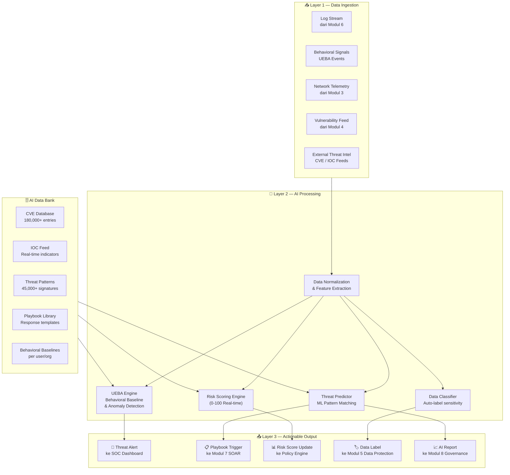

---

## 🎯 AI Risk Scoring Engine (0–100)

Setiap pengguna dan perangkat mendapat **skor risiko real-time** yang dihitung dari kombinasi faktor:

```mermaid
flowchart LR
    subgraph FACTORS["⚖️ Faktor Kalkulasi Risk Score"]
        F1["Lokasi Login\nApakah normal? +0-20"]
        F2["Waktu Akses\nDi luar jam kerja? +0-15"]
        F3["Status Device\nAntivirus aktif? +0-20"]
        F4["Pola Perilaku\nSesuai baseline? +0-25"]
        F5["Riwayat Ancaman\nInsiden sebelumnya? +0-10"]
        F6["Privilege Level\nMakin tinggi makin riskan +0-10"]
    end

    CALC["🧮 Risk Calculator\nWeighted Sum Algorithm"]
    
    subgraph RESULT["📊 Hasil & Aksi"]
        LOW["0-30: 🟢 LOW\nAkses normal"]
        MED["31-60: 🟡 MEDIUM\nStep-up Auth"]
        HIGH["61-80: 🟠 HIGH\nAlert SOC + Restrict"]
        CRIT["81-100: 🔴 CRITICAL\nBlok + Playbook + Isolasi"]
    end

    FACTORS --> CALC --> RESULT
```

| Skor | Level | Aksi Otomatis |
|------|-------|---------------|
| 0–30 | 🟢 **LOW** | Akses normal, monitoring pasif |
| 31–60 | 🟡 **MEDIUM** | Step-up authentication (MFA ulang) |
| 61–80 | 🟠 **HIGH** | Alert ke SOC, batasi akses resource sensitif |
| 81–100 | 🔴 **CRITICAL** | Blokir instan, trigger playbook SOAR, isolasi device |

---

## 🧠 UEBA — Behavioral Analysis Engine

UEBA membangun **baseline perilaku normal** per pengguna selama 30 hari pertama, lalu mendeteksi deviasi:

| Indikator Anomali | Contoh Deteksi | Risk Impact |
|-------------------|----------------|-------------|
| **Impossible Travel** | Login dari Jakarta jam 08:00, login dari London jam 09:00 | +40 skor |
| **Off-Hours Access** | Akses database produksi tengah malam | +20 skor |
| **Data Exfiltration Pattern** | Download 10GB data dalam 10 menit | +35 skor |
| **Privilege Escalation** | Pengguna biasa tiba-tiba akses admin panel | +45 skor |
| **Lateral Movement** | Akses ke server yang tidak pernah diakses sebelumnya | +30 skor |
| **Credential Stuffing** | 50+ login gagal dalam 1 menit | +50 skor |

---

## 🗄️ AI Data Bank

Database pengetahuan keamanan yang terus diperbarui secara otomatis:

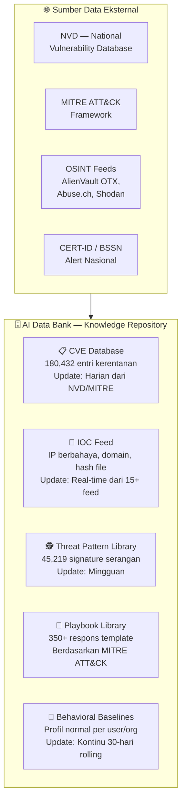

---

## 🔌 Endpoint AI API Lengkap

| Method | Endpoint | Fungsi | Tier Minimum |
|--------|----------|--------|--------------|
| `POST` | `/api/v1/ai/analyze-threat` | Analisis log/event mencurigakan | Professional |
| `GET` | `/api/v1/ai/risk-score/{user_id}` | Skor risiko real-time per user | Starter |
| `GET` | `/api/v1/ai/risk-score/{device_id}` | Skor risiko per device | Starter |
| `GET` | `/api/v1/ai/recommend-playbook` | Rekomendasi respons otomatis | Professional |
| `POST` | `/api/v1/ai/classify-data` | Klasifikasi sensitivitas data | Professional |
| `GET` | `/api/v1/ai/threat-intel` | Query CVE & IOC dari Data Bank | Professional |
| `POST` | `/api/v1/ai/behavioral-analysis` | Analisis pola perilaku UEBA | Enterprise |
| `GET` | `/api/v1/ai/predictions` | Prediksi ancaman berbasis tren | Enterprise |
| `GET` | `/api/v1/ai/databank/status` | Status AI Data Bank (jumlah CVE, IOC) | Starter |

---

## 🔒 Privacy-First AI Design

> [!IMPORTANT]
> **AI ZentyCore TIDAK pernah menjual atau membagikan data perilaku pengguna ke pihak ketiga manapun.** Model AI dilatih menggunakan data anomali yang telah dianonimkan, bukan data identitas asli.

- **Federated Learning**: Model AI dapat dilatih secara lokal di infrastruktur klien enterprise tanpa data keluar
- **Data Anonymization**: Semua data yang masuk ke AI distrip dari PII (Personally Identifiable Information) sebelum diproses
- **Explainable AI**: Setiap keputusan AI disertai alasan yang dapat dibaca manusia (tidak black-box)
- **Human Override**: Tim SOC selalu bisa override keputusan AI — AI hanya merekomendasikan, bukan mendiktasi

---

---

# BAGIAN 2 — 🎫 LICENSING SYSTEM

## Arsitektur Sistem Lisensi

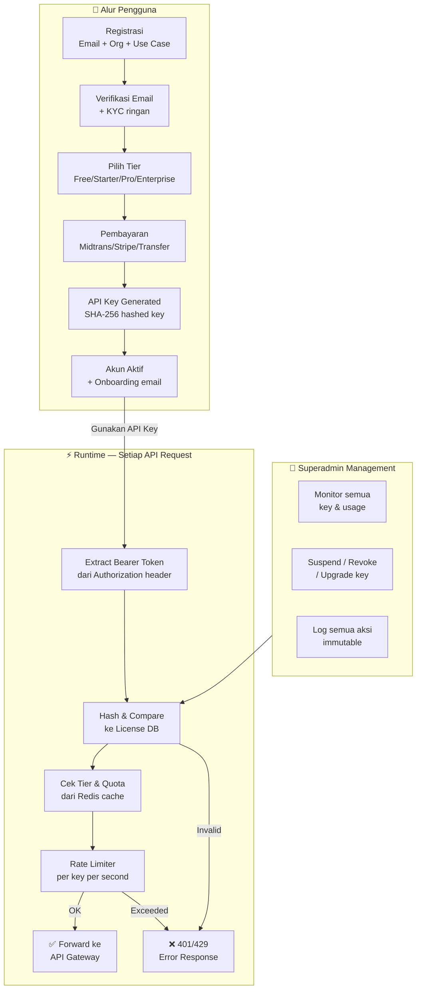

---

## 🔐 Keamanan API Key

> [!CAUTION]
> **API Key tidak pernah disimpan dalam bentuk plaintext.** Hanya hash-nya yang ada di database. Jika hilang, pengguna harus generate key baru.

```
Alur Pembuatan API Key yang Aman:

1. Generate random 256-bit secure token
   → zt_live_a9f3b2c4d8e1f7a0b5c9d2e6f1a4b8c3...

2. Hash dengan BLAKE3 (lebih cepat & aman dari SHA-256):
   → blake3("zt_live_a9f3...") = "9c4f2a8b1e3d..."

3. Simpan di database: HANYA hash-nya
   → users.api_key_hash = "9c4f2a8b1e3d..."

4. Kirim ke pengguna: HANYA sekali, via email terenkripsi
   → Tidak bisa dilihat lagi dari dashboard setelah ini!

5. Setiap request: hash input → compare ke stored hash
   → Tidak perlu decrypt, aman dari database
```

## BAB II: SISTEM LISENSI & HYBRID LICENSING FRAMEWORK

### 2.1 Arsitektur Lisensi Berlapis (Hybrid Multi-Tier Licensing)
Untuk menjaga keterbukaan komunitas open-source sekaligus melindungi kekayaan intelektual dan monetisasi bisnis CTARTech, ZentyCore menerapkan **Hybrid Quad-Layer Licensing Framework**:

```
┌──────────────────────────────────────────────────────────────────────────────┐
│                  HYBRID QUAD-LAYER LICENSING ARCHITECTURE                    │
├──────────────────────────────────────────────────────────────────────────────┤
│ Layer 1: Core Engine (AGPLv3)           ──► Open-Source, No Secret Forks    │
│ Layer 2: Extended Platform (BSL 1.1)    ──► Free Internal, Anti-Cloud Piracy │
│ Layer 3: Enterprise & AI (Commercial)   ──► Paid Subscription Keys           │
│ Layer 4: Cloud Moat & Trademark (CTAR)  ──► Real-Time Threat Feed & Brand IP │
└──────────────────────────────────────────────────────────────────────────────┘
```

1. **Layer 1 - Core Engine (Lisensi AGPLv3):**
   - Mencakup: Rust Policy Engine Core, 8 Modul Interface standar, Rust SDK.
   - Aturan: Gratis untuk komunitas & pengembang. Modifikasi yang di-hosting di jaringan/cloud wajib dibuka kodenya ke publik.
2. **Layer 2 - Extended Platform (Lisensi BSL 1.1 / Fair-Source):**
   - Mencakup: Standard Web Dashboard UI, Standard Connectors & Webhooks.
   - Aturan: Bebas digunakan untuk kebutuhan internal organisasi, dilarang keras menjualnya kembali sebagai managed service/SaaS yang bersaing dengan CTARTech.
3. **Layer 3 - Enterprise & AI Power-Pack (CTARTech Commercial License):**
   - Mencakup: AI Behavioral UEBA Engine (0-100 Risk Scoring), Multi-Tenant Superadmin, Automated Compliance Auditor (OJK, BSSN, GDPR, ISO 27001), SOAR Automated Containment Playbooks.
   - Aturan: Memerlukan kunci lisensi resmi berbayar dengan verifikasi kriptografis.
4. **Layer 4 - Cloud Threat Intelligence Moat & Legal Safeguards:**
   - Feed data 180.000+ CVE & 45.000+ IOC Real-time terpusat di CTARTech Cloud.
   - Perlindungan Merek Dagang resmi: *"CTARTech"* & *"ZentyCore"*.
   - Contributor License Agreement (CLA) untuk setiap kontributor open-source.

### 2.2 Tier Lisensi Komersial (Enterprise Layer)

### 🆓 Free Tier
```
Limit      : 1,000 API calls / bulan
Reset      : Tanggal 1 setiap bulan (bukan rolling)
Modul      : Identity (verify only) + Visibility (read only)
AI Access  : ❌ Tidak tersedia
Webhook    : ❌ Tidak tersedia
Support    : Community forum only
SLA        : Best effort
Rate Limit : 10 req/menit
Burst      : Max 20 req/menit selama 30 detik
```

### 🥈 Starter Tier — IDR 500.000/bulan
```
Limit      : 50,000 API calls / bulan
Reset      : Rolling 30 hari
Modul      : Identity, Device, Network, Visibility
AI Access  : Risk Score endpoint only
Webhook    : ✅ Max 3 endpoint
Support    : Email (response 48 jam)
SLA        : 99.5% uptime
Rate Limit : 100 req/menit
Burst      : Max 200 req/menit selama 60 detik
Overage    : IDR 5/call setelah limit
```

### 🥇 Professional Tier — IDR 2.000.000/bulan
```
Limit      : 500,000 API calls / bulan
Reset      : Rolling 30 hari
Modul      : Identity, Device, Network, App, Data, Visibility, Response (7 modul)
AI Access  : Semua endpoint kecuali behavioral-analysis & predictions
Webhook    : ✅ Max 10 endpoint
Support    : Email + Live chat (response 8 jam)
SLA        : 99.9% uptime
Rate Limit : 1,000 req/menit
Burst      : Max 2,000 req/menit selama 60 detik
Overage    : IDR 3/call setelah limit
```

### 💎 Enterprise Tier — Custom Pricing
```
Limit      : Unlimited (fair use policy)
Modul      : Semua 8 modul + AI Engine penuh
AI Access  : Semua endpoint termasuk Federated Learning
Webhook    : ✅ Unlimited endpoint
Support    : Dedicated TAM + 24/7 hotline (response 1 jam)
SLA        : 99.99% uptime + financial penalty jika breach
Rate Limit : Custom sesuai kebutuhan
Dedicated  : Opsional isolated deployment
On-premise : Tersedia untuk data sovereignty
```

### 🔓 Open-Source (Self-Hosted) — Gratis
```
Limit      : Tidak ada (infrastruktur sendiri)
Lisensi    : GPL-3.0
AI Access  : Harus setup sendiri (model open-source tersedia)
Support    : Community GitHub Discussions
Update     : Manual pull dari repository
```

---

## 📬 Sistem Alert Quota

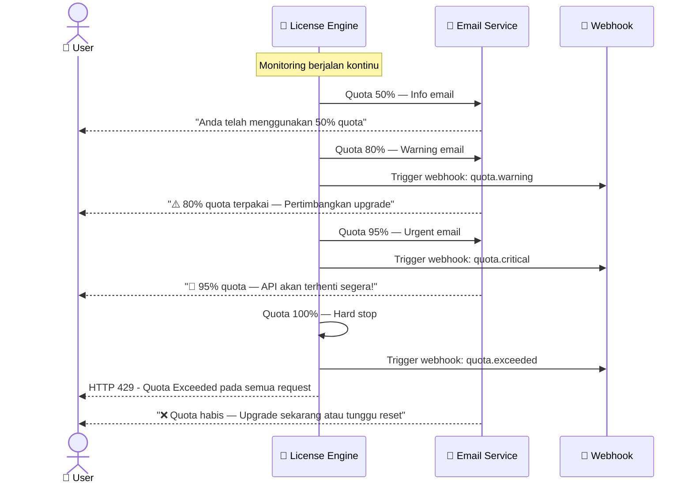

---

## 🛡️ Anti-Abuse Mechanism

| Mekanisme | Implementasi |
|-----------|-------------|
| **IP Rate Limiting** | Max 1000 req/jam per IP (terlepas dari API key) |
| **Key Rotation Enforcement** | API key wajib di-rotate setiap 90 hari |
| **Concurrent Session Limit** | Max 5 concurrent connection per key |
| **Anomalous Usage Detection** | AI mendeteksi pola penggunaan API yang mencurigakan |
| **Geographic Restriction** | Opsional: kunci API key ke region tertentu |
| **Allowed IP Whitelist** | Enterprise: batasi key hanya bisa dipakai dari IP tertentu |

---

---

# BAGIAN 3 — 🖥️ DASHBOARD SPECIFICATION

## Tampilan Visualisasi

````carousel

<!-- slide -->

<!-- slide -->

````

---

## 🗂️ Halaman & Fitur Dashboard

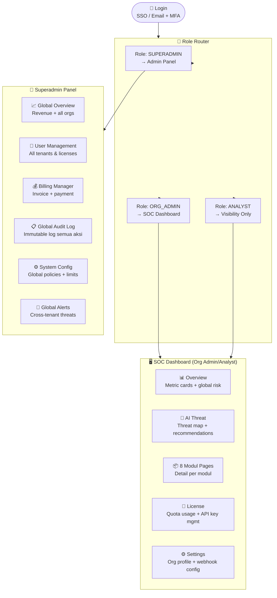

---

## 🎨 Design System

| Elemen | Spesifikasi |
|--------|-------------|
| **Background** | `#0f172a` (Deep Navy) |
| **Surface Cards** | `#1e293b` dengan border `#334155` |
| **Primary Accent** | `#3b82f6` (Electric Blue) |
| **Success/Safe** | `#10b981` (Emerald Green) |
| **Warning** | `#f59e0b` (Amber) |
| **Danger/Critical** | `#ef4444` (Red) |
| **AI/ML Purple** | `#a855f7` (Purple) |
| **Typography** | `Inter` + `JetBrains Mono` (code) |
| **Card Style** | Glassmorphism + subtle glow on hover |
| **Animations** | Framer Motion — smooth transitions |
| **Icons** | Lucide React — consistent icon set |

### Tech Stack Frontend

```
Next.js 14 (App Router)
TypeScript — type safety penuh
Recharts / Tremor — grafik & visualisasi data
React Query — data fetching & real-time polling
Framer Motion — micro-animations premium
Lucide React — icon library
SWR — real-time log streaming
Socket.IO client — WebSocket untuk live telemetry
```

---

## 📱 Halaman SOC Dashboard — Detail Fitur

### Home / Overview
- **4 Metric Cards**: Global Risk Score, Active Sessions, AI Threats Blocked, Compliance Score
- **Risk Timeline Chart**: Grafik risiko 24 jam terakhir
- **Module Health Grid**: Status 8 modul dalam satu tampilan (green/amber/red)
- **Recent Activity Feed**: 10 aktivitas terbaru dengan severity badge

### AI Threat Intelligence Page
- **World Threat Map**: Peta dunia interaktif dengan titik serangan real-time
- **AI Risk Gauge**: Speedometer skor risiko organisasi saat ini
- **Behavioral Timeline**: Grafik anomali UEBA 7 hari terakhir
- **AI Recommendations Panel**: 3-5 rekomendasi tindakan dari AI
- **AI Data Bank Status**: Jumlah CVE, IOC, patterns terkini

### 8 Modul Pages (masing-masing)
- Status aktif/nonaktif modul
- Key metrics modul tersebut
- Log aktivitas modul (50 terbaru)
- Test endpoint (playground API langsung dari browser)
- Konfigurasi dasar modul

### License Management Page
- **Quota Gauge**: Visual usage vs limit (progress bar + persentase)
- **API Key Manager**: View (masked), copy, rotate, revoke
- **Usage History Chart**: Grafik penggunaan per hari 30 hari terakhir
- **Webhook Configuration**: Tambah/edit/hapus webhook endpoints
- **Upgrade Button**: One-click upgrade dengan perbandingan tier

---

## ♿ Aksesibilitas & Responsif

- WCAG 2.1 Level AA compliance
- Keyboard navigation penuh
- Screen reader friendly (ARIA labels)
- Responsive: Desktop (1440px) → Tablet (768px) → Mobile (360px)
- Dark mode only (sesuai standar cybersecurity dashboard)
- RTL support untuk Arabic (Timur Tengah)

---

---

# BAGIAN 4 — ⚠️ HAL KRITIS TEKNIS
## Untuk Kekhawatiran Pengguna LinkedIn, Rekan & Perusahaan

> [!IMPORTANT]
> **Ini adalah bagian paling penting.** Pengguna LinkedIn, profesional keamanan siber, dan perusahaan yang membutuhkan keamanan data punya **kekhawatiran yang sangat sah dan valid**. Bagian ini menjawab setiap kekhawatiran secara teknis dan transparan.

---

## 😰 Kekhawatiran Nyata yang Sering Muncul

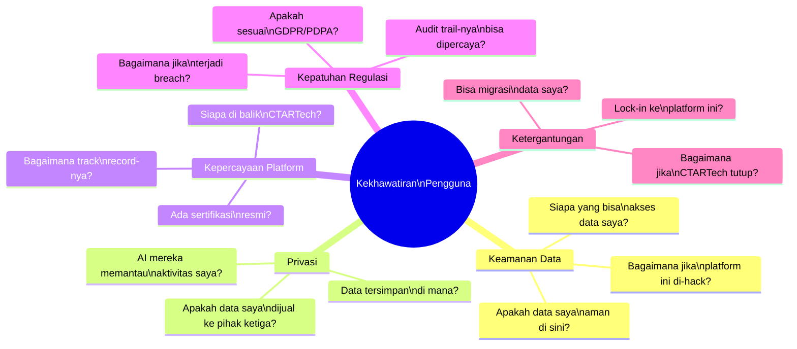

---

## ✅ Jawaban Teknis: 7 Pilar Kepercayaan ZentyCore

### Pilar 1 — Zero-Knowledge Architecture

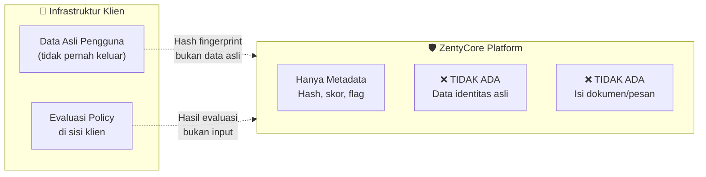

**Yang TIDAK pernah masuk ke server ZentyCore:**
- ❌ Password atau kredensial pengguna
- ❌ Isi dokumen, email, atau pesan
- ❌ Data pribadi (NIK, rekening bank, dll)
- ❌ Kunci enkripsi klien

**Yang masuk ke server ZentyCore:**
- ✅ Hash token (bukan token asli)
- ✅ Metadata akses (siapa, kapan, ke resource apa — dianonimkan)
- ✅ Skor risiko terkalkulasi
- ✅ Flag anomali (yes/no, bukan detail penyebab)

---

### Pilar 2 — End-to-End Encryption

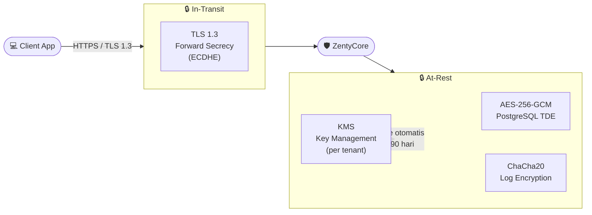

---

### Pilar 3 — Data Minimization Principle

> *"Kami hanya mengumpulkan data yang benar-benar kami butuhkan untuk memberikan layanan — tidak lebih."*

| Data | Dikumpulkan? | Alasan |
|------|:---:|--------|
| Username / email admin | ✅ | Untuk autentikasi & notifikasi |
| Password | ❌ | Hashed di sisi klien, tidak dikirim |
| IP address pengguna akhir | ✅ Hashed | Untuk deteksi anomali lokasi |
| Isi file/dokumen klien | ❌ | Tidak relevan untuk Zero Trust |
| Metadata akses | ✅ | Diperlukan untuk evaluasi risiko |
| Data keuangan klien | ❌ | Tidak pernah menyentuh platform ini |
| Kontak/relasi sosial | ❌ | Tidak relevan sama sekali |

---

### Pilar 4 — Transparency & Audit

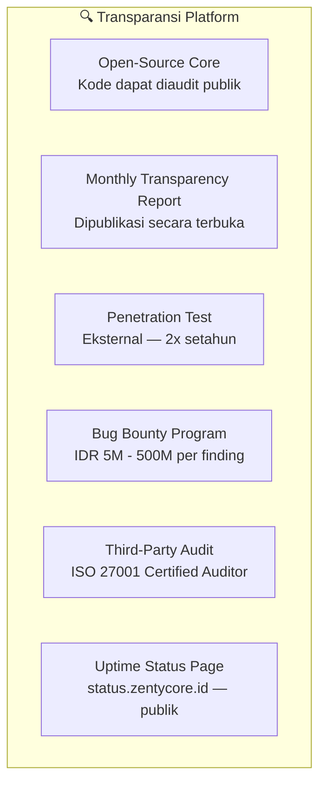

**Transparency Report Bulanan mencakup:**
- Jumlah request yang diproses (tanpa detail klien)
- Jumlah ancaman yang diblokir (agregat)
- Uptime actual vs SLA
- Jumlah security incidents (jika ada) + tindakan yang diambil
- Perubahan kebijakan privasi (jika ada)
- Permintaan data dari pemerintah (jika ada)

---

### Pilar 5 — Incident Response & Breach Notification

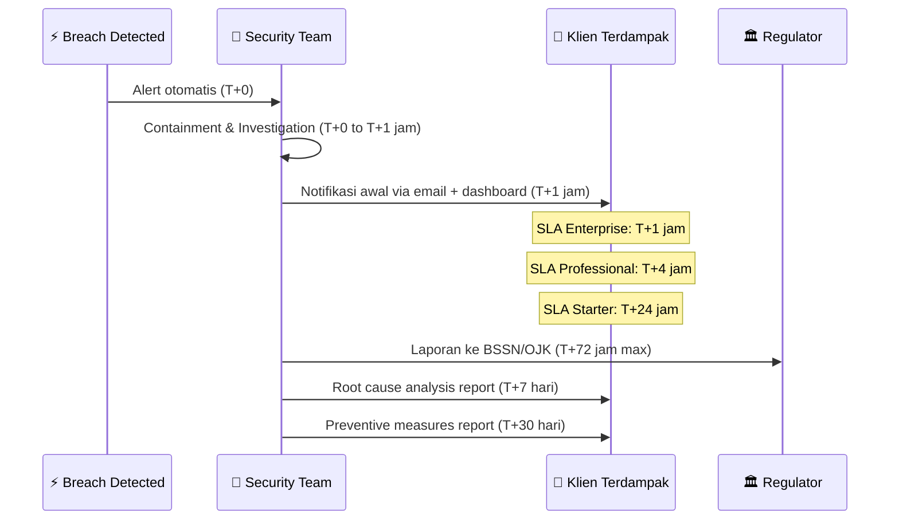

---

### Pilar 6 — No Vendor Lock-In (Data Portability)

> [!TIP]
> **Anda bisa keluar kapan saja dengan membawa semua data Anda.**

```
Hak Portabilitas Data Klien:
✅ Export semua data dalam format JSON/CSV/NDJSON
✅ Export audit log dalam format SIEM-compatible (CEF/LEEF)
✅ Export policy configuration dalam format YAML
✅ Export API key history (metadata saja, bukan key asli)
✅ Semua export tersedia dalam 24 jam setelah request
✅ Akun dapat dihapus permanen dengan konfirmasi

Setelah akun dihapus:
→ Data dihapus dari production DB dalam 24 jam
→ Data dihapus dari backup dalam 30 hari
→ Certificate of deletion dikirimkan via email
```

---

### Pilar 7 — Open-Source & Self-Hosting Option

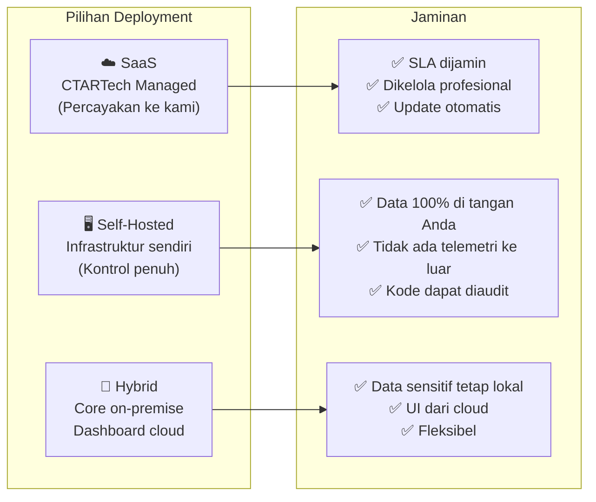

---

## 🎯 Skenario Kekhawatiran Spesifik Pengguna LinkedIn & Perusahaan

### Skenario A — "Saya khawatir data karyawan perusahaan saya bocor"

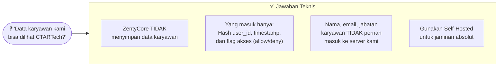

---

### Skenario B — "Bagaimana jika AI ZentyCore disalahgunakan untuk memata-matai?"

| Kekhawatiran | Mitigasi Teknis |
|-------------|-----------------|
| AI memantau konten komunikasi | AI hanya melihat **metadata** (kapan, dari mana, ke mana) — bukan isi |
| AI mengidentifikasi pegawai kritis | UEBA berbasis pola agregat, bukan profiling individu |
| Data AI digunakan untuk kepentingan lain | Contractual obligation: data hanya untuk Zero Trust evaluation |
| AI membuat keputusan bias | Explainable AI + human override wajib sebelum aksi kritis |

---

### Skenario C — "Bagaimana jika CTARTech sebagai perusahaan diretas?"

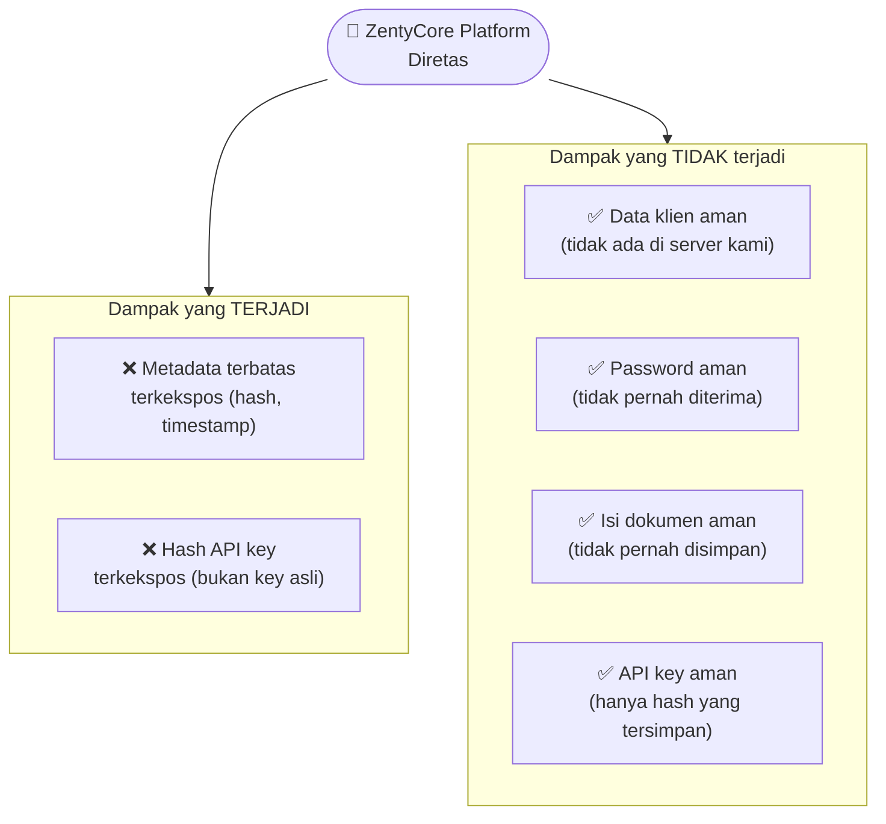

---

### Skenario D — "Perusahaan kami di sektor keuangan / kesehatan — ada compliance khusus?"

| Sektor | Regulasi | Fitur ZentyCore yang Relevan |
|--------|----------|------------------------------|
| **Perbankan** | OJK POJK 11/2022, PBI | Modul 5 Data Protection, Immutable Audit Log, Laporan kepatuhan OJK |
| **Fintech** | POJK 77/2016, PCI-DSS | WAF (M4), Enkripsi KMS (M5), Real-time monitoring (M6) |
| **Kesehatan** | Permenkes 24/2022 | Data classification (HIPAA-aligned), akses berbasis role ketat |
| **Pemerintah** | PP 71/2019, BSSN | On-premise deployment, BSSN compliance report |
| **Manufaktur** | ISO 27001 | Governance modul (M8), audit report otomatis |

---

## 🛡️ Ringkasan Jaminan Keamanan

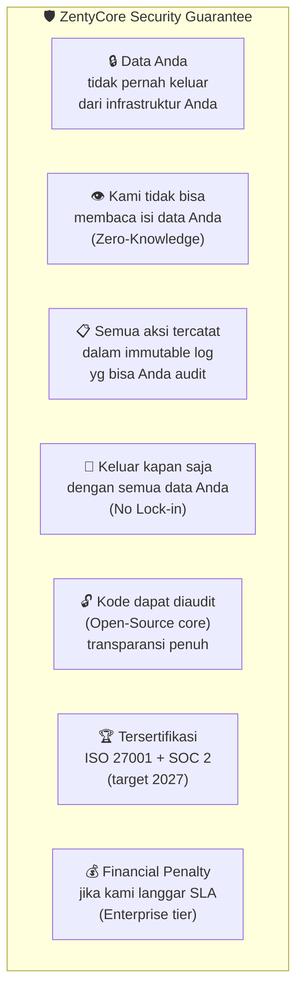

---

---

## BAB V: SISTEM BILLING, PAYMENT GATEWAY & SUPERADMIN LICENSE GENERATOR

### 5.1 Alur Pembayaran Terintegrasi & Auto-Provisioning
ZentyCore mengintegrasikan sistem checkout dan multi-payment gateway untuk mendukung transaksi otomatis baik lokal (Indonesia) maupun internasional (Global):

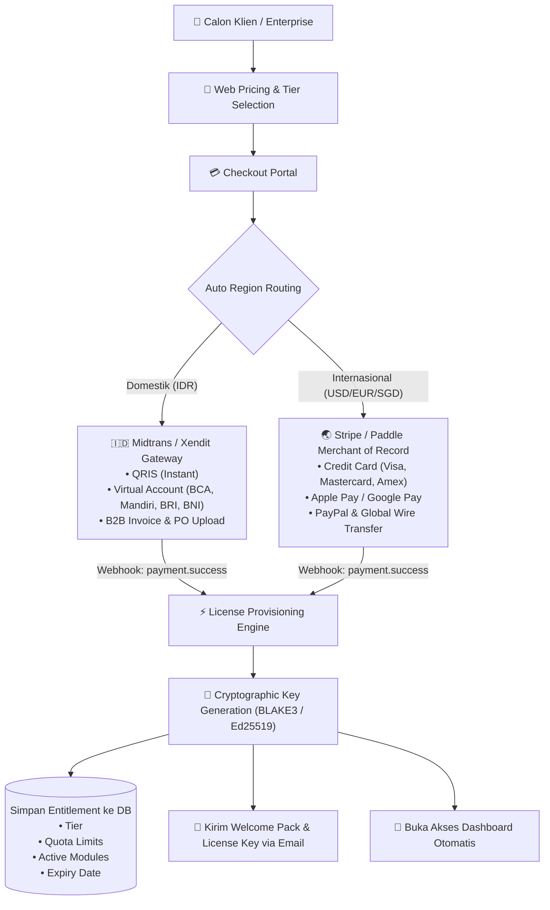

---

### 5.2 Superadmin Web Portal — License Management & Control Plane
Superadmin memiliki akses pusat komando komprehensif melalui antarmuka web khusus:

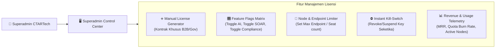

**Matriks Pengaturan Lisensi di Superadmin:**
| Pengaturan | Opsi Nilai | Penjelasan |
|------------|------------|------------|
| **Tier** | Free, Starter, Pro, Enterprise, Custom Gov | Menentukan baseline kuota dan paket modul |
| **Duration** | 30 Hari, 1 Tahun, 3 Tahun, Lifetime | Batas masa aktif lisensi |
| **Node/Device Limit** | 10 s/d Unlimited | Batas endpoint yang boleh terdaftar di Modul Device |
| **AI Engine Access** | ON / OFF | Akses ke modul UEBA dan Dynamic Risk Scoring |
| **SOAR Automated Containment** | ON / OFF | Akses ke eksekusi otomatis playbook insiden |
| **Compliance Suite** | OJK, BSSN, GDPR, NIST, Full | Modul audit dan pelaporan kepatuhan regulasi |
| **Deployment Mode** | Cloud SaaS, Self-Hosted Connected, Air-Gapped Offline | Mode operasi lisensi klien |

---

### 5.3 Offline / Air-Gapped License Engine (Solusi Khusus Bank & BUMN)
Untuk instansi perbankan, militer, dan BUMN yang **menjalankan sistem tanpa koneksi internet publik (Air-Gapped Network)**, ZentyCore menyediakan sistem lisensi asimetris offline:

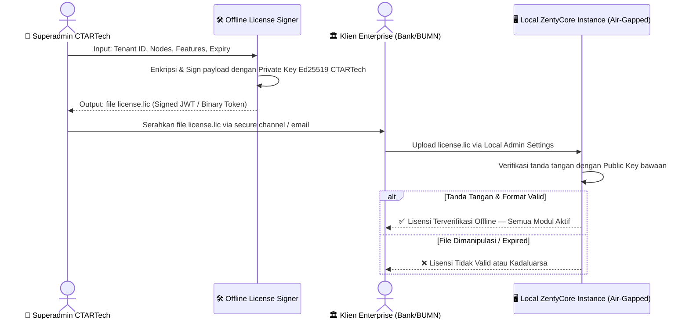

**Karakteristik Lisensi Offline:**
1. **Zero Internet Requirement:** Validasi terjadi 100% di server lokal menggunakan aljabar kriptografi Ed25519.
2. **Anti-Tamper Cryptographic Seal:** Jika klien mengubah isi tanggal/kuota di file `.lic`, signature menjadi tidak cocok dan sistem langsung mengunci diri.
3. **Machine Fingerprint Binding (Opsional):** Lisensi dapat diikat ke hardware UUID / CPU ID server klien agar tidak dapat digandakan ke server lain.

---

### 5.4 Layanan Faktur Pajak & Corporate Purchase Order (B2B)
- **Otomatisasi PPN 11%**: Menerbitkan e-Faktur Pajak resmi Indonesia untuk badan usaha berbadan hukum (PT / CV).
- **Alur Pengadaan PO (Purchase Order)**: Opsi pembayaran termin (TOP 30 hari) bagi korporat enterprise setelah approval dokumen legal.

---

> [!NOTE]
> **Pesan untuk Pengguna LinkedIn & Rekan Profesional**: ZentyCore dibangun dengan prinsip bahwa **platform keamanan itu sendiri harus menjadi contoh terbaik keamanan**. Kami tidak meminta kepercayaan buta — kami membangun sistem yang membuktikan kepercayaan melalui transparansi, kode terbuka, dan jaminan kontraktual yang dapat dipegang secara hukum.

---
*CTARTech ZentyCore — "Security for everyone, everywhere. Built with trust, not just code."*

